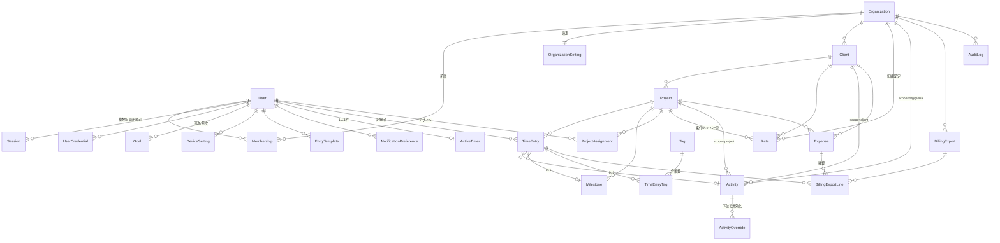
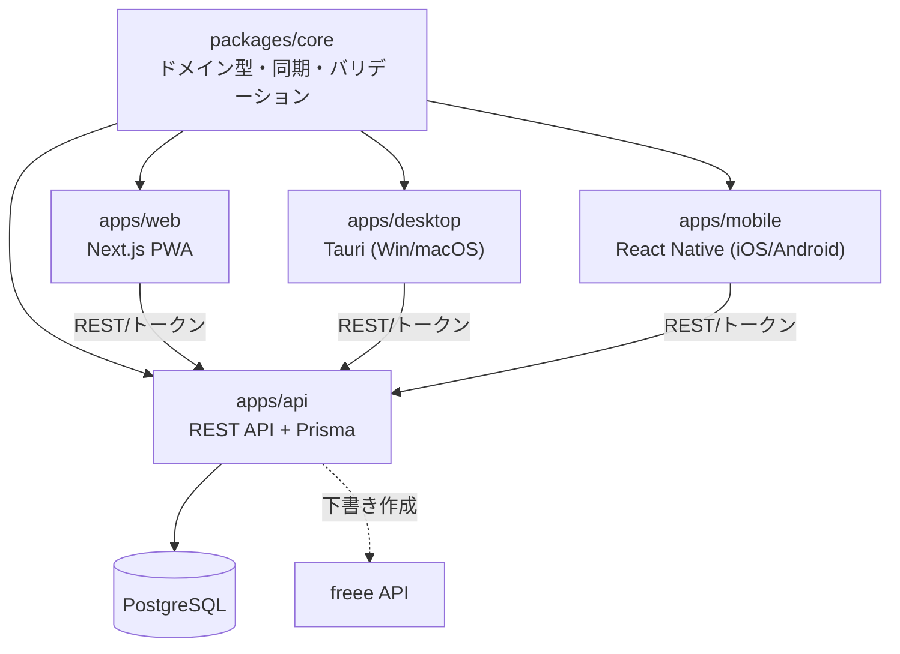
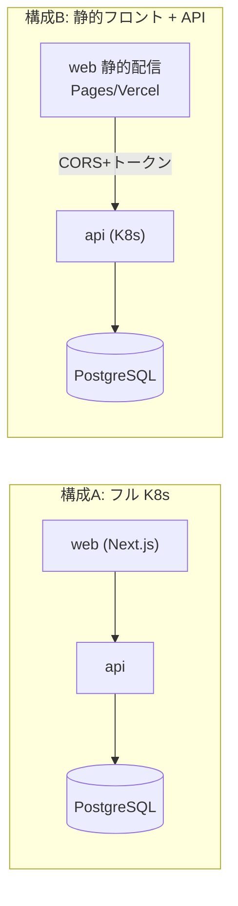
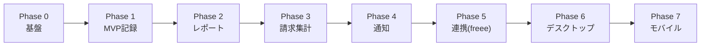

# PRD: マルチクライアント対応 稼働時間トラッカー

> ステータス: Draft v1.2（未確定事項クローズ済み） / 最終更新: 2026-06-27
> オーナー: katsunori_kuroda@neko-room.com

## 目次
1. 概要 / 背景・課題 / ゴール
2. ターゲットユーザー・ペルソナ・主要ユースケース
3. スコープ（In / Out）と MVP 定義
4. 機能要件（記録 / 階層・作業種別 / レポート・着地見込み / 請求・経費 / 通知 / 連携 / 生産性 / データ品質）
5. 非機能要件（オフライン同期 / 認証 / TZ / 監査・DR / 設定階層 / i18n / テスト・可観測性 / a11y / セキュリティ）
6. データモデル
7. アーキテクチャ（monorepo / 技術スタック / デプロイ）
8. ロール×権限マトリクス
9. ロードマップと受け入れ基準
10. 未決事項 / 将来検討

---

## 1. 概要 / 背景・課題 / ゴール

### 1.1 概要
複数のクライアント・複数案件にまたがる稼働時間を、レコード単位で「どのクライアントの
どの案件か」を明確に分けて記録・集計・請求できる稼働時間トラッカー。
小規模チーム（数名〜十数名）での利用を想定し、モバイル / デスクトップ / Web から
操作できる。まず **PWA を先行**して開発し、後続フェーズで **ネイティブアプリ**へ拡張する。
ネイティブの範囲は **デスクトップ（Windows / macOS、Tauri、フル機能 + トレイ常駐）を先に**、
続いて **モバイル（iOS / Android、React Native）**。いずれも `packages/core` と同一 API を共有する。

### 1.2 背景・課題
- 複数クライアント・複数案件を並行で進めると、どの時間がどの案件のものか曖昧になりやすい。
- スプレッドシート運用では、メンバー横断の集計・請求書化・記録漏れ防止が手間。
- 移動中や現場でも記録したいが、オフライン環境では既存ツールが使いにくい。
- 請求業務（時間 → 金額 → 請求書）まで一気通貫で繋げたい。

### 1.3 ゴール
- レコード単位でクライアント / 案件を必ず紐づけて記録できる（作業種別・タグは任意で補完）。
- タイマーと手動入力の両方で、PC・スマホ・タブレットから素早く記録できる。
- オフラインでも記録でき、オンライン復帰時に自動同期される。
- チームの稼働状況をダッシュボード・レポートで可視化し、**請求は freee 下書きまで**繋げられる。
- 将来のネイティブアプリ展開を見据え、ロジック・型を共有できる設計にする。

### 1.4 非ゴール（このプロダクトでやらないこと）
- 勤怠管理（打刻・給与計算・有給管理）そのもの。
- プロジェクト管理（タスク進捗・ガント・チケット管理）の本格機能。
- 大規模マルチテナント SaaS としての課金プラン・セルフサインアップ最適化（初期は対象外）。
- 請求書の発行業務（番号採番・PDF・適格請求書の体裁・送付）そのもの。これは freee に委譲し、本プロダクトは billable 集計を下書きとして渡すまでを担う。
- 原価レート（社内コスト）・収益性（粗利）分析。売上ベースの集計・請求に専念する。

---

## 2. ターゲットユーザー・ペルソナ・主要ユースケース

### 2.1 ペルソナ
- **管理者（オーナー）**: チーム運営者。クライアント / 案件 / メンバー / レート / 請求を管理。
- **マネージャ**: 担当案件のメンバー稼働を把握し、案件の工数・予算を管理。
- **メンバー**: 自分の稼働時間を記録する実務担当者。リモート / 外出先からも記録。

### 2.2 主要ユースケース
- UC-1: メンバーがタイマーを開始し、案件を選んで作業、停止して記録を確定する。
- UC-2: メンバーが後から「14:00〜15:30 / A社 / サイト改修」を手動入力する。
- UC-3: 圏外でタイマー記録 → 電波復帰時に自動で同期される。
- UC-4: マネージャが今週の案件別・メンバー別の稼働をダッシュボードで確認する。
- UC-5: 管理者が月末に特定クライアントの billable レコードを集計し、freee 請求書の下書きを生成する。
- UC-6: 管理者が請求書を freee に下書きとして連携する。
- UC-7: メンバーが記録し忘れた日に、リマインダー通知を受け取る。
- UC-8: マネージャが案件の見積工数の超過アラートを受け取る。

---

## 3. スコープ（In / Out）と MVP 定義

### 3.1 MVP（最初のリリース）
- **コア記録機能**: タイマー（開始 / 停止）+ 手動入力。
- クライアント / 案件 / タグの CRUD、レコードの一覧・編集・削除。
- 認証（メール&パスワード + OIDC SSO）、組織 / メンバー招待、3ロール権限。
- PWA としてインストール可能、**オフライン記録 → 同期**。
- **稼働レコードの CSV インポート**（既存スプレッドシート / 他ツールからの初期移行）。

### 3.2 後続フェーズ（Out of MVP）
- レポート / ダッシュボード / CSV・Excel エクスポート（Phase 2）。
- レート設定・billable 区別・請求書生成・freee 連携（Phase 3, 5）。
- リマインダー / 工数上限アラート（Phase 4）。
- カレンダー連携 / Slack 通知 / 会計 SaaS 連携（Phase 5）。
- ネイティブアプリ: **デスクトップ（Tauri / Win・macOS、Phase 6）→ モバイル（iOS・Android、Phase 7）**。

---

## 4. 機能要件

### 4.1 記録（タイマー + 手動入力）
- タイマー: ワンタップで開始 / 停止。開始時に案件選択（直近利用案件をサジェスト）。
- 実行中タイマーは全画面・全デバイスで状態が見える（同期）。**1ユーザー1アクティブタイマー**（同時複数計測は不可。実行中に別タイマーを開始したら前のものを停止確定）。
- 手動入力: 開始 / 終了時刻、または所要時間（分）での入力。日付指定で過去分も追加。
- 共通項目: クライアント・案件（必須）、作業種別（アクティビティ・任意）、タグ（任意・複数）、メモ、**参照 URL リンク（任意・複数。チケット / PR / ドキュメント等）**、billable フラグ、入力種別（timer / manual）。
- 記録の編集・分割・複製・削除。
- **必須は案件のみ**（案件さえ選べば記録可。メモ等は任意で素早く記録）。
- **案件の可視性**: 「公開（組織全員が記録可）/ アサイン限定（`ProjectAssignment` のメンバーのみ）」を案件ごとに設定。同一案件に複数メンバーが関わる場合も両方式に対応。
- **メンバーの案件作成**: 組織設定で「メンバーもクライアント / 案件を作成可」を切替。許可時は記録中に **その場でクイック作成**（後で管理者が整理）。
- **時間の丸めは行わない**（実測のまま分単位で記録・集計・送信。表示も分単位）。
- **入力動線（モバイル / PC 両対応）**:
  - **スマホ片手操作**: 親指の届く範囲・数タップでタイマー開始。
  - **ホーム画面クイックエントリー**: PWA のショートカット / ウィジェットから直接開始・再開。
  - **PC キーボード高速入力**: ショートカット / コマンドパレットで案件検索・記録を素早く。
- **タイマー UX**:
  - **クイック再開**: 直近停止した記録をワンタップで再開。
  - **アイドル検出**: **既定 10 分**（ユーザーで変更可）の操作なし / スリープを検知し、「まだ計測中か」「アイドル時間を破棄するか」をポップアップで確認（破棄 / 計上を選択）。
  - **ポモドーロ（任意）**: 既定 **25 分作業 / 5 分休憩**（変更可）。**休憩は稼働レコードに含めない**。使わない人は通常のタイマーのまま。
- **計測中の編集**: 走行中でも案件 / 作業種別 / メモを変更できる。
- **開始時刻の遡及修正**: 「10 分前に始めていた」を後から開始時刻調整できる。
- **複数端末同期**: PC で開始しスマホで停止、のように端末をまたいで同一タイマーを継続（サーバ正）。
- **日跨ぎ**: 夕方開始→翌日停止などは **分割せず 1 レコードのまま**保持（集計は開始日基準）。
- **重なり禁止**: 同一ユーザーの時間帯が重複する記録は **保存時バリデーションで不可**。オフラインで検出できなかった重複は **同期時に検出**し、ユーザーに解消を促す。
- **承認・ロックフローは設けない**（請求前の確定ロックなし。いつでも編集可。送信履歴で二重送信のみ防止）。

### 4.2 階層・タグ
- **クライアント > 案件** の2階層。レコードは案件に紐づく（→クライアントは案件経由で決定）。
- 案件は見積工数 / 予算 / 期間 / アクティブ状態を持つ。
- **タグ**は組織内で自由定義し、レコードに複数付与可能（例: 緊急 / レビュー）。アクティビティを補完する横断集計用のゆるい分類。

### 4.2.1 作業種別（アクティビティ）— 多階層 + テンプレート
作業種別はレコードに1つ付与する構造化された分類軸で、集計・請求カテゴリにも使う。
**スコープを多階層**にし、上位を継承しつつ下位で上書き / 追加できる。

- **グローバル組み込みテンプレート**: システム提供の **汎用セット1つ**。初期セットは **9 種で確定**: **設計 / 開発 / レビュー / 会議 / 調査 / ドキュメント / テスト / 保守 / 管理・雑務**。新規組織はここから取り込んで開始できる。
- **登録スコープ（継承順）**: **グローバルテンプレート → 組織 → クライアント → 案件**。
  - 各スコープで種別を **追加** でき、上位から継承した種別を下位で **無効化（非表示）** もできる。
  - 例: 組織共通の「開発 / 会議」に加え、特定クライアントだけ「保守対応」、特定案件だけ「移行作業」を追加。社内会議が不要な案件では無効化。
- **種別の属性**: **色 / アイコン**（ダッシュボード・グラフでの識別）と **billable 既定値**（例「社内会議 = 非 billable」を記録時に自動セット、変更可）。
- **デフォルト種別**: スコープ（組織 / 案件）ごとに既定の作業種別を指定でき、新規記録時に自動セット（変更可）。
- **案件での絞り込み**: 限定（強制）はせず、案件でよく使う種別を **推奨として上位表示**するのみ（どの種別でも選択可）。
- 集計・レポート・freee 明細カテゴリの軸として利用。

### 4.3 レポート・集計（Phase 2）
- **ダッシュボード主要ビュー**:
  - **今週 / 今月の合計**（billable / 非 billable 内訳つき）。
  - **メンバー稼働一覧**（管理者 / マネージャ向け）。
  - **クライアント / 案件別の構成比**（円グラフ等）。
  - **見積消化ゲージ**（見積工数 / 予算に対する進捗バー）。
  - **稼働率（ユーティリゼーション）**: billable 時間 / 総稼働、目標稼働に対する達成率。
- **期間比較**: 前週比 / 前月比の増減・トレンドを表示。
- **トレンドグラフ**: **月次推移**（クライアント / 案件別の月ごとの稼働）、**billable 率の推移**、**クライアント構成比の推移**（比重の偏りの変化）を時系列で表示。
- メンバー別集計: 管理者 / マネージャがチームメンバーごとの稼働を確認。
- **週表ビュー（タイムシート）**: 週 × 案件のグリッドで一覧・手動入力・編集（横断的に素早く埋められる）。
- 周次 / 月次レポート: 定期サマリをアプリ内で自動生成・表示（**メール等への定期スケジュール配信はスコープ外**。週次サマリの Slack 投稿は 4.6 の連携で対応）。
- **エクスポート**: CSV / Excel(xlsx) で、**明細（生レコード）** と **集計（サマリ）** の両方を出力。**期間・クライアント・メンバー・タグでフィルタ**指定可能。経費も対象に含む。

### 4.3.1 月次着地見込み（フォーキャスト）
月の途中で、その月の **着地見込み（このままのペースでの月末予測）** を表示する。
- **予測対象**: **総稼働時間** / **billable 金額** / **案件別見通し**（見積消化の着地）/ **メンバー別見通し**。
- **算出ロジック**: **稼働日ペースの線形外挿**を既定とする
  — `経過稼働日の実績 ÷ 経過稼働日数 × 月の総稼働日数`（**祝日・休日は除外**、組織の稼働日設定に従う）。
  実績のみで予測し、**カレンダー予定は加味しない**。
- **信頼度はレンジ（最小〜最大）で表示**: 「今月の経過実績ペース」と「直近数週の平均ペース」の両方から幅を出し、**最小〜最大の帯**で見せる。月初などデータが少ない時期は **「参考値」**と注記。
- **表示**:
  - **ダッシュボードカード**（今月の実績と着地見込みレンジを並記）。
  - **見積工数 / 月次上限 / ミニマム / 月次目標 に対して見込みを並記**（消化の着地が見える）。
  - **月次目標との比較**（週間目標の月版。達成見込みかを表示）。
  - **超過予測アラート**: 見込みが見積 / 上限を超えそうなら早期警告（**単一しきい値で 1 回**、4.5 の工数アラートと連動）。**通知先は本人（メンバー）と担当マネージャ**。
  - **週次サマリ**（Slack / メール）にも着地見込みを記載。

### 4.4 請求（自前は集計、発行は freee に委譲）（Phase 3 / 5）
- **方針**: 請求書そのもの（番号採番・PDF・適格請求書の体裁・送付）は **freee に委譲**し、本プロダクトでは保持しない。本プロダクトは **billable 集計** を持ち、freee へ **下書き** として渡す（UC-6）。
- レート: **組織 > クライアント > 案件**の単価に加え、**メンバー別レート**（役割 / ユーザー単位）も設定可。解決は「案件×メンバー > 案件 > クライアント > 組織既定」。**税抜で入力**し、**通貨**（複数通貨対応）・**税率**（消費税 10% / 8%）を保持して試算。
- **レートは適用開始日を持ち履歴管理**: 単価変更後も過去の記録は当時のレートで試算（遡及しない）。
- **ミニマムチャージ（月最低）**: 案件の **月次の最低請求**（時間 or 金額）を設定。スコープは **案件 > クライアント > 組織**で解決。
  - **実測記録は変えない**（丸めはしない）。月の billable が最低を下回る場合に **最低額で計上**する。
  - **集計・レポート表示にも反映**（請求だけでなくダッシュボードの billable 金額にも最低を適用）。
  - **月途中の開始 / 終了の日割りは設定で切替**（稼働日数に応じた按分の有無を案件ごとに選択）。
- billable / non-billable をレコード単位で区別。
- **freee 連携（下書き作成）**:
  - **接続単位は組織で1つ**: 管理者が一度 freee を OAuth 連携し、組織全体でその接続を共有。**標準の OAuth2 認可コードフロー + リフレッシュトークン自動更新**（トークンはサーバで安全に保持）。詳細スコープは実装時に freee API 仕様へ合わせる。
  - **源泉徴収・適格請求書（登録番号 / 端数 / 体裁）はすべて freee に委譲**（本ツールは税抜額を渡すのみで保持しない）。
  - **マスタ同期**: freee の **取引先一覧を取得**して `Client` にマッピング（候補サジェスト + 手動確定）。未マッピングは送信前に検出してブロック。
  - 集計対象を選び、freee の請求書 **下書き** を作成（適格請求書番号の採番・登録番号・最終的な税計算は freee 側に委ねる）。
  - **まとめ単位はユーザーが都度選択**（クライアント / 案件 / 期間 / 明細単位の組み合わせ）。
  - **明細行の粒度も生成時に選択**（案件単位で集約 / 作業種別単位 / 日別 など）。
  - 二重送信防止のため、送信記録（freee 下書き ID・対象 TimeEntry・送信日時）を保持。送信済みレコードは再送対象から除外。
- **生成のトリガー（両対応）**:
  - **手動**: 管理者が「下書き生成」を実行（いつでも）。
  - **締日に自動**: クライアントの締日に下書きを自動生成し、管理者が確認。
- **明細の品目名 / 表現**:
  - **品目名は可変テンプレート差込**で自動生成（例: `{案件名} {期間} 作業費`。利用可能な差込子: 案件 / クライアント / 期間 / 作業種別 等）。
  - **数量 × 単価表現**: **「時間(h) × 時給」**で明細化（**時間課金のみ**を対象。固定月額 / 顧問料 / 人月はスコープ外）。
- **送信前プレビュー / 編集**:
  - 生成される **明細・金額を送信前にプレビュー**。
  - 本ツールでの編集は **行の統合 / 除外・品目名・個別メモ**まで。**値引き・調整（マイナス行）は freee 側で行う**（本ツールには持たない）。
- **エラー処理**:
  - **トークン失効**時は管理者に **再連携を促す**。
  - **未マッピング**（取引先未紐付け）を事前検出してブロック。
  - **送信ログ**を保持し、部分失敗は **再試行**可能。
- **請求対象期間の選び方**:
  - **月次締め**（月末 / 任意締日）、**任意期間**（開始〜終了を手動指定）、**マイルストーン単位**（案件の納品 / フェーズ）。
  - **クライアントごとの締日**を設定し、月次締めに自動適用。
  - **基本は「1 クライアント × 期間 = 1 請求」**（マイルストーン等で分けたい場合のみ複数化）。
  - **期日・請求日は freee の既定（取引先設定）に任せる**（本ツールでは指定しない）。
- **freee への動線**: 下書き作成後、`freeeDraftId` から **freee の該当下書きを開くディープリンク**を表示（仕上げは freee で行う）。
- **フォールバック**: 請求は **freee 連携前提**（freee 以外への請求書フォールバック出力は持たない。記録 / 集計の CSV エクスポートは別途あり）。
- **送信後の編集**: freee 送信済み期間の元レコードを後から編集したら、**「請求と差異あり」と警告**し、再送 / 手当てを促す（自動上書きはしない）。
- **請求ステータスの追跡は最小**: 本ツールは各レコード / 期間が **「freee 送信済みか否か」**のみ管理（入金・確定などの進捗管理は freee 側）。
- **請求の監査**: 送信履歴・再送履歴・送信後の差異記録を保持（誰がいつ何を freee に送ったか追跡可能）。
- **通貨は換算しない**: 各案件の通貨のまま集計・送信。複数通貨が混在するレポートは **通貨別に分けて表示**（基準通貨への換算はしない）。
- **金額の丸め・端数・税の最終計算は freee に委ねる**（本ツールは試算のみ）。
- 自前で持つのは「何をいくらで freee に渡したか」の **送信履歴** のみ。請求書 PDF・確定金額の正は freee。

### 4.4.1 経費（Expense）
- **経費を記録**し、稼働時間と並べて集計・請求できる。
- **紐付け**: 経費は **案件 または クライアント直下**のどちらにも紐づけられる（両方許容）。
- **属性**: **税込金額**で入力（税の最終計算は freee）、通貨、日付、説明、**請求可否（billable / 立替か社内経費か）**、**領収書 URL**（Google Drive 等のリンク参照。ファイル実体は持たない）。
- **freee 連携**: **billable な経費は freee 下書きの明細行に追加**（作業費の明細と並べて 1 請求に含める）。送信履歴・二重送信防止は作業費と同様に扱う。
- **記録権限**: 組織設定で「メンバーも経費を登録可」を切替（許可時は自分の立替経費を登録、管理者が確認）。
- **承認フローなし**（稼働と同様にロック / 承認は設けない。送信履歴で二重送信のみ防止）。
- **通貨**: 経費は **案件の通貨に揃えて入力**（自動換算はしない＝支払通貨が違う場合は手動で換算して入力）。
- マークアップ（上乗せ）・経費カテゴリの細分化・経費専用レポートは当面スコープ外（将来検討）。

### 4.5 通知・リマインダー（Phase 4）
- **通知チャネル**: アプリ内 / **PWA プッシュ（Web Push）** / メール / Slack（チャネルはユーザー設定で選択）。
- **記録し忘れリマインダー** の検知トリガー:
  - **稼働日の未記録**: 稼働日（曜日設定）に記録 0 件なら通知。**日本の祝日は自動取得して稼働日判定から除外**（休日扱い）。
  - **タイマー出しっぱなし**: 長時間走りっぱなしのタイマーを検知して警告。
- **工数上限アラート** の基準（**しきい値は案件ごとに可変**）:
  - **見積工数比**: 案件の見積時間に対する消化率（例 80% / 100%）。
  - **予算（金額）比**: 案件予算額に対する billable 金額の消化率。
  - **月次上限**: クライアント / 案件の月次上限時間の超過。
  - **着地見込み超過（予測）**: 月次着地見込み（4.3.1）が見積 / 上限を超えそうな場合に **実超過前に**警告。
- **通知タイミング**: 未記録リマインダーは **稼働日の終業時刻（既定 18:00 目安、組織設定で変更可）** に送信。**静穏時間（既定 夜間 21:00〜翌 8:00 / 休日）はプッシュを抑止**し、翌営業開始にまとめる。ユーザーごとに静穏時間・送信時刻を上書き可能。

### 4.6 外部連携（Phase 5）
- **カレンダー連携（読取りのみ）**: Google カレンダー等の予定を取り込み（カレンダーには書き戻さない）。
  - **案件推定は「キーワード一致」**（予定タイトル等のキーワードで案件を推定）→ ルールで下書き化 → **ユーザーが確認して確定**。
  - **取り込み範囲 / 除外**: 辞退済みの予定を除外、**特定カレンダーのみ**対象、終日 / 非業務の予定を除外。
- **Slack 連携（双方向）**:
  - **通知**: リマインダー（未記録 / タイマー放置）・工数アラート。
  - **週次サマリ投稿**: チーム / 個人の週次稼働サマリを定期投稿。
  - **Slack から記録**: `/track` 等のコマンドでタイマー開始 / 停止。
- 会計 SaaS 連携: **freee（請求書下書きの作成）を第一優先**。マネーフォワード等は将来検討。
- いずれの外部サービスとの同期も **読取りのみ**を基本とする（freee への下書き作成を除く）。

### 4.7 生産性・入力補助
- **最近の案件サジェスト**: タイマー開始時に直近・高頻度の案件を上位表示。
- **お気に入り / テンプレート**: よく使う「案件 × 作業種別（× メモ）」の組み合わせを保存し、ワンタップ記録 / 即タイマー開始。
- **週間 / 月次目標 / ペース**: 週・月の目標時間を設定し、進捗・残ペース・達成見込みを表示。
- **端末ごとの既定クライアント / 案件**（ネイティブ）: デバイス単位で既定の案件を指定し、その端末では迷わず即記録（例: 現場用タブレットは常に特定案件）。

### 4.7.1 検索・フィルタ
- **全文検索**: メモ本文を横断検索。
- **多軸フィルタ**: 期間 / クライアント / 案件 / 作業種別 / タグ / メンバー / billable で絞り込み。
- **保存フィルタ**: よく使う条件を保存して再利用（レポート・一覧・エクスポートで共通）。

### 4.7.2 一括操作（バルク）
- **一括削除 / 復元**（論理削除と取消）。
- **一括 billable 切替**（期間をまとめて請求可否変更）。
- **一括再割当**（複数レコードの案件 / タグをまとめて変更）。

### 4.7.3 案件のライフサイクル
- 案件状態は **アクティブ / アーカイブ** の 2 状態。アーカイブは新規記録の選択肢から外すが、過去記録・集計・請求履歴は保持。
- **削除ガード**: 紐づく記録があるクライアント / 案件は **削除でなくアーカイブを推奨**（論理削除は可能だが、影響範囲を警告してから実行）。

### 4.8 データ品質チェック
- **未分類 / 要修正一覧**: 案件未設定・重なり・極端に長い / 0 分などの **要対応レコードを集約**して解消へ誘導（5.7.1 と連動）。
- **不自然検知**: 24 時間超 / 0 分 / 未来日付などを検知して警告。
- **月次クローズ推奨**: 月末に「請求前の確認チェックリスト」を提示（ロックはしない＝任意の手続き）。

---

## 5. 非機能要件

### 5.1 オフライン同期
- **ローカル保持は軽量方針**: IndexedDB に保持するのは **進行中の計測 + 未同期の変更（およびマスタ: 案件 / アクティビティ / タグ）** のみ。過去の確定済みレコードはオンライン取得（必要分のみキャッシュ）。
- オフライン時は **新規記録・進行中計測・直近キャッシュの閲覧** が可能。同期完了後はローカルの確定済みデータを保持し続けない（容量を抑える）。
- 同期エンジン: クライアント生成 UUID + `updatedAt` + tombstone（`deletedAt`）による push / pull。
- 競合解決: 小規模運用のため **last-write-wins**（レコード単位、`updatedAt` 比較）を基本とする。
- 実行中タイマーはサーバ正をソースに、復帰時に整合を取る。
- **孤児レコードの扱い**: オフライン中に削除された案件へ記録してしまった場合も **記録は破棄しない**。
  - 案件は論理削除（tombstone）なので、同期時に紐づく記録があれば **案件を復活表示**し、記録は保全。
  - 復活させたくない場合は記録を「**未分類**（要再割当）」として残し、ユーザーに再割当を促す（請求集計からは除外）。
- **データ保持**: レコード・監査ログともに **無期限保持**（自動アーカイブ / 自動削除は行わない）。削除はユーザー操作による論理削除のみ。

### 5.2 認証・権限
- メール&パスワード + OIDC SSO の両対応（Auth.js / Credentials + OIDC プロバイダ）。
- **OIDC プロバイダ**: 汎用 OIDC（任意プロバイダを設定可能）を基本とし、**Microsoft Entra ID** と **Google Workspace** を主要サポート対象とする。
- メンバー招待はメールリンク方式。加えて **SSO ジャストインプロビジョニング**（許可された IdP で初回ログイン時にユーザーを自動作成）。
- **招待管理**: 招待リンクに **有効期限**、未承諾の **再送 / 取消**、組織の **座席（シート）上限**管理。
- **複数組織所属**: 1 ユーザーが複数組織に所属でき、UI で組織を切替（`Membership` で設計済み）。
- ロール×権限はセクション8の通り（ロールは所属組織ごと）。

### 5.3 タイムゾーン
- 想定は **国内中心 + 将来海外**。レコードの時刻は **UTC で保持**し、表示・集計は **ユーザー TZ** で行う。
- ユーザー / 組織ごとに TZ を保持し、将来の海外メンバーにフル対応できる設計とする（当面の既定は JST）。
- **集計の日境**: 個人の表示・集計は **記録者の TZ** で「その日」を判定。一方 **請求集計は組織の基準 TZ** で日境をそろえ、請求の一貫性を担保する（TZ が混在するチームでの二重基準を明示）。
- **サマータイム（DST）**: IANA タイムゾーンデータベースに従い、UTC 保持 + TZ ライブラリで自動吸収（個別対応は不要）。

### 5.4 監査・データ保持・削除
- **変更履歴ログ（監査ログ）**: レコード / 案件 / レート等の作成・編集・削除を「誰が・いつ・何を」記録。
- **論理削除**: 削除は tombstone（`deletedAt`）によるソフトデリートとし、同期と整合・復元可能に。
- **退会時エクスポート**: メンバー / 組織のデータを一括エクスポートできる（退会・解約時のデータ持ち出し）。
- **退会メンバーの記録**: 本人アカウントは無効化するが、**過去の稼働・請求記録は組織に保全**（集計・請求の整合を維持。表示は「退会済み」扱い）。

### 5.4.1 バックアップ・復旧（DR）
- **定期 DB バックアップ**: 自動バックアップとリストア手順を整備（取得頻度・保持世代を運用で定義）。
- **外部ストレージへの自動バックアップ（オプション）**: 組織の **Google Workspace 共有ドライブ** / **OneDrive for Business（SharePoint）** に、エクスポート（CSV / アーカイブ）を **定期自動保存**する機能。組織が自分のクラウドに控えを持てる。
- 補助的に、オフライン同期の性質上、各端末にも未同期データのローカルコピーが残る。

### 5.4.2 設定の階層
- 設定は **組織 > クライアント > 案件 > 個人** の 4 階層で継承・解決する。
- 階層継承する主な設定: **レート / 作業種別 / ミニマムチャージ**（組織〜案件）、**通知・表示の好み**（個人）。
- 下位が未設定なら上位を継承、下位で上書き可能。

### 5.5 国際化（i18n）
- 当面の UI は **日本語のみ**、通貨は円中心（外貨は請求データとして保持）。
- ただし将来の海外メンバー向けに **i18n 基盤（メッセージ外部化・ロケール切替の仕組み）だけは最初から用意**する。

### 5.6 テスト・品質
- **ユニット + 結合テスト** を基本とし、特に **オフライン同期・競合解決（LWW）・孤児レコード処理** を重点的にテスト（`packages/core` のドメインロジックをカバレッジ重視で検証）。
- freee 連携・集計金額・税率計算は結合テストで検証。
- CI でビルド / lint / テスト / コンテナイメージ生成を自動実行（Phase 0 基盤）。

#### 可観測性
- **エラー監視**（Sentry 等）でクラッシュ / 例外を収集。
- **稼働メトリクス**（API 応答時間・同期成功率・キュー滞留など）を公開・監視。
- 利用分析を行う場合も記録内容には踏み込まず、最小限の匿名指標に留める。

### 5.7 アクセシビリティ・UI
- 目標水準 **WCAG 2.1 AA 相当**: キーボード操作、適切なコントラスト、フォーカス可視化、スクリーンリーダ対応（記録の開始 / 停止など主要操作）。
- **ダーク / ライトテーマ**対応（システム設定追従 + 手動切替）。
- **ブランディングは シンプル・中立**（作業ツールらしい落ち着いた配色、アクセント 1 色）。派手な装飾は避ける。
- **表示設定（個人 / 組織）**: **時間表記の切替**（`1:30` ⇄ `1.5h`）、**週の始まり曜日**、**数値・通貨書式**（桁区切り / 通貨記号）、**一覧のコンパクト表示**（行間密度）。
- モバイル / デスクトップで操作しやすいレスポンシブ UI、タッチターゲット確保。

### 5.7.1 空状態・エラー UX（丁寧に）
- **初回オンボーディング**: 組織作成 → クライアント / 案件 → 最初の記録、までを案内する **セットアップチェックリスト**（進捗が見える）。**作業種別テンプレートの取り込み**を最初に提示。
- **空状態**: 記録 0 件 / 案件未作成などで、次にやるべきアクションを示す（「最初の案件を作る」「タイマーを開始」）。
- **同期状態の可視化**: 「同期済み / 未同期 N 件 / 同期中 / 同期失敗」を常時わかる形で表示。
- **オフライン表示**: オフライン中であることと、ローカル保存されている旨を明示（記録は失われないと安心させる）。
- **アプリ更新**: 新バージョン検知時に **「更新します」と通知して再読込**（Service Worker の更新フロー。計測中データは失わない）。
- **同期失敗・競合**: 失敗理由と再試行、重なり / 孤児レコードなどの **要対応項目を一覧化**して解消へ誘導。
- **エラー全般**: 復旧手段を伴う分かりやすいメッセージ（無言の失敗を作らない）。

### 5.8 セキュリティ
- **セッション管理**: ログイン中端末の一覧表示と遠隔ログアウト、セッション失効。
- **2 要素認証（2FA）**: メール&PW ログインに TOTP 等の 2FA をオプション提供。
- **レートリミット**: 認証・API への過剰リクエストを制限。
- **監査**: 認証イベント（ログイン / 失敗 / トークン更新）を監査ログに記録。
- 組織単位のデータ分離、最小権限、通信 TLS、保存時の機微情報保護。
- **データ保存リージョン**: 特段の地域要件なし（コスト / 可用性優先）。将来顧客要求が出た場合に再検討。

### 5.9 その他
- パフォーマンス: 記録の開始 / 停止は体感即時。一覧は仮想化・ページング。
- **マルチテナント余地**: 当面は自チーム利用だが、**将来の他組織提供を視野**に、`Organization` 単位のデータ分離を最初から徹底する（セルフサインアップ・プラン課金は将来検討）。
- 可用性: PWA はオフラインでも基本操作可能。サーバ障害時もローカル記録は継続。デプロイは Docker / Kubernetes 前提（ステートレス・水平スケール・ローリングアップデート、詳細は7.4）。

---

## 6. データモデル

### 6.1 主要エンティティ
- `Organization`: テナント（チーム）。
- `User`: 利用者アカウント。
- `Membership`: org × user × **role**（admin / manager / member）。**1 ユーザーが複数組織に所属可能**。
- `Session`: ログインセッション（端末情報 / 失効）。`UserCredential`: パスワード / 2FA(TOTP) シークレット / OIDC 連携。
- `OrganizationSetting`: 組織設定（週の始まり曜日 / 稼働日・休日 / 既定通貨 / 時間表示単位 / 既定 TZ / **日本の祝日自動除外** / メンバーの案件作成可否 / メンバーの経費登録可否 / 座席上限）。
- `EntryTemplate`: お気に入り / テンプレート（案件 × 作業種別 × メモ等の保存セット）。
- `Goal`: ユーザー（/ チーム）の目標時間。**週次 / 月次**の期間を持ち、目標比較・着地見込み比較に利用。
- `SavedFilter`: 保存した検索 / フィルタ条件（一覧・レポート・エクスポート共通）。
- `DeviceSetting`: 端末ごとの既定クライアント / 案件（ネイティブ）。
- `Client`: クライアント（org 配下）。**`freeePartnerId`**（freee 取引先 ID）/ **締日**（請求月次締め用）を保持。
- `Project`: 案件（client 配下）。見積工数 / 予算（金額）/ 月次上限 / **月次ミニマムチャージ（時間 or 金額）** / アラートしきい値（%）/ 期間 / アクティブ状態 / **可視性**（公開 = 組織全員 / アサイン限定）。ミニマムは Client / Organization にも設定でき階層解決。
- `Milestone`: 案件のマイルストーン（納品 / フェーズ）。マイルストーン単位の請求対象に利用。
- `ProjectAssignment`: 案件 × ユーザー（マネージャ等のアサイン）。マネージャの「担当案件」範囲を決定。
- `NotificationPreference`: ユーザー × チャネル（in-app / push / email / slack）× 種別（リマインダー / アラート）の購読設定。
- `Activity`: 作業種別。**`scope`**(global / org / client / project) + 任意の `clientId` / `projectId` + `parentId`（継承元）を持ち、上位を継承しつつ下位で追加。`color` / `icon` / `defaultBillable` 属性、各スコープの既定指定 `isDefault`、案件での推奨フラグを持つ。
- `ActivityOverride`: 下位スコープでの上位種別の **無効化（非表示）** 指定（scope + 対象 activityId）。
- `Tag`: org 内自由タグ。`TimeEntryTag`: レコード×タグの中間（複数付与）。
- `TimeEntry`: レコード。`user` / `project` / 開始終了 or 所要時間 / メモ / `billable` /
  `source`(timer | manual) / 同期メタ(`uuid`, `updatedAt`, `deletedAt`)。
- `Rate`: 時間単価（**税抜で入力**）。**通貨** / **税率** / **`effectiveFrom`（適用開始日）** を保持。**適用粒度は 案件 > クライアント > 組織既定**で解決し、加えて **メンバー別（役割 / ユーザー単位）レート**も設定可（案件×メンバーが最優先）。レートは適用期間を持ち、**各 `TimeEntry` はその日時に有効なレート**で試算（過去分は遡って変わらない）。
- `BillingExport` + `BillingExportLine`: **freee 送信履歴**（請求書そのものは持たない）。`freeeDraftId` / `status`(draft 作成 / 成功 / 部分失敗 / 失敗) / 送信日時 / まとめ単位・明細粒度 / 対象期間 / エラーログを保持。`BillingExportLine` は品目名・メモ・手動調整値と対象 `TimeEntry` **または `Expense`** を参照（作業費・経費の両明細）。二重送信防止・再試行に使用。
- `Expense`: 経費。`projectId` または `clientId`（両方許容）/ **税込金額** / 通貨 / 日付 / 説明 / **billable**（立替請求 or 社内経費）/ **領収書 URL**。billable 経費は `BillingExportLine` 経由で freee 明細に追加。
- `AuditLog`: 監査ログ（actor / 対象エンティティ / 操作種別 / 変更前後 / 日時）。
- `ActiveTimer`: ユーザーごとの実行中タイマー（**1ユーザー1件**、project / 開始時刻）。

### 6.2 関係（ER概要）

---

## 7. アーキテクチャ

### 7.1 構成（monorepo）
- pnpm workspaces + Turborepo。
  - `packages/core`: ドメインモデル・型・バリデーション・同期ロジック（web / native / api 共有）。
  - `apps/web`: Next.js PWA（静的 / エッジホスティングにも出せる構成）。
  - `apps/api`: REST API（Prisma）。web から疎結合に分離してデプロイ可能。
  - 将来 `apps/desktop`: **Tauri**（Win / macOS）。`apps/web` のフロント資産 + `packages/core` を流用し、トレイ常駐などネイティブ機能を追加。
  - 将来 `apps/mobile`: React Native / Expo（iOS / Android。`packages/core` と API を共有）。

### 7.2 技術スタック
- フロント / PWA: Next.js (React) + TypeScript、Service Worker（Workbox / next-pwa）でインストール可能化。
- オフライン層: IndexedDB（Dexie）+ push / pull 同期エンジン。
- バックエンド: **フロントから疎結合な REST API**（Prisma）。Web / 将来ネイティブ / 静的ホスティング構成のいずれからも同一 API を利用。
  - 認証はトークンベース、CORS を適切に設定し、**フロントと API を別ホストにデプロイ可能**にする（下記7.4）。
  - API は `apps/api`（または web と分離可能な構成）として独立デプロイできるようにする。
- DB: PostgreSQL + Prisma。
- 認証: Auth.js (NextAuth) — Credentials(メール&PW) + OIDC。
- 出力: CSV / Excel(xlsx) エクスポート（**請求書 PDF は生成しない＝発行は freee に委譲**）。

### 7.3 PWA → ネイティブ拡張戦略
- ドメイン・同期・型を `packages/core` に集約し、UI 層のみ web / native で差し替え。
- API は REST + 共有型で、ネイティブからも同一エンドポイントを利用。

### 7.4 デプロイ / インフラ（Docker + Kubernetes 前提、2 トポロジ対応）
本プロダクトは以下 **2 つのデプロイ構成のどちらも選べる**よう、フロントと API を疎結合に保つ。

- **構成A: フル Docker / K8s**: フロント（Next.js）と API の両方をコンテナ化し、同一クラスタにデプロイ。
- **構成B: 静的フロント + API バックエンド**: フロントを **静的 / エッジホスティング（GitHub Pages / Cloudflare Pages / Vercel）** に配信し、**API のみ Docker / K8s** で運用。
  - フロントは静的エクスポート / SPA ビルドが可能な構成にし、API へは CORS + トークン認証で接続。

- **コンテナ化**: API（および構成 A ではフロント）をマルチステージ Dockerfile でビルドし、コンテナイメージとして配布。
  - イメージは GHCR / レジストリにタグ付き push（CI でビルド・脆弱性スキャン）。
- **Kubernetes デプロイ**:
  - 各サービスは Deployment + Service + Ingress（TLS は cert-manager / Ingress で終端）。
  - 水平スケール（HPA）を想定。アプリはステートレスに保ち、状態は DB / オブジェクトストレージへ外出し。
  - DB マイグレーション（Prisma migrate）は Job / initContainer で適用。
  - 設定・機微情報は ConfigMap / Secret（OIDC クライアントシークレット、DB 接続情報、freee API トークン等）。
  - 構成は Helm chart（または Kustomize overlay）で環境別（dev / staging / prod）に管理。
- **PostgreSQL**: マネージド DB（Cloud SQL / RDS / Neon 等）と、クラスタ内 StatefulSet / Operator（CloudNativePG 等）の **両方を環境で選択可能**にする（接続情報は Secret で差し替え）。
- **ローカル開発**: docker compose で web + PostgreSQL を起動できるようにする。
- **可観測性 / 運用**: ヘルスチェック（liveness / readiness probe）、ログ標準出力、メトリクス公開を前提に設計。

---

## 8. ロール×権限マトリクス

| 操作 | 管理者(Admin) | マネージャ(Manager) | メンバー(Member) |
|---|---|---|---|
| 自分の稼働記録 CRUD | ✓ | ✓ | ✓ |
| 他メンバーの記録閲覧 | 全員 | 担当案件のみ | **同じ案件のみ** |
| 他メンバーの記録の代理編集 | ✓（監査ログに記録） | ✗ | ✗ |
| クライアント / 案件管理 | ✓ | 担当案件のみ | △（組織設定で許可時のみ作成可） |
| 作業種別 / タグ管理 | ✓ | ✓ | 付与のみ |
| メンバー招待 / ロール変更 | ✓ | ✗ | ✗ |
| レート設定 / freee 請求下書き連携 | ✓ | ✗ | ✗ |
| 監査ログ閲覧 / 退会時エクスポート | ✓ | ✗ | ✗ |
| レポート / エクスポート | ✓ | 担当範囲 | 自分のみ |

> マネージャの「担当案件」範囲は **`ProjectAssignment`（案件ごとのアサイン）** で決定する。アサインされた案件のみ閲覧・管理可能。

---

## 9. ロードマップと受け入れ基準

> **実装着手順の方針**: まず **記録 UI（タイマー / 手動入力）をローカルで動かす**ことを優先し、早期に触れる画面を用意する。認証 / Org / 同期はその後に肉付けする（Phase 0 / 1 の作業順序として意識）。
> **成功指標（KPI）**: ①**記録率・継続利用**（稼働日に記録しているメンバー割合・継続率）、②**稼働率（billable 率）の可視化**を主指標とする。
> **期限は未定**（マイペースで進行）。フェーズは規模に応じて分割・前後可。

- **Phase 0 — 基盤**: monorepo 構築、認証（メール&PW + OIDC）、Org / メンバー招待、3ロール権限、**コンテナ化 + Kubernetes デプロイ基盤**（Dockerfile / Helm or Kustomize / CI ビルド・push、docker compose ローカル環境）。
  - 受け入れ: 招待→ログイン→ロールに応じた画面表示ができる。コンテナイメージが CI でビルドされ、K8s（または compose）にデプロイして起動・ヘルスチェックが通る。
- **Phase 1 — MVP**: クライアント / 案件 / タグ CRUD、**タイマー + 手動入力**、レコード一覧 / 編集、PWA インストール可 + オフライン記録 → 同期、**稼働レコードの CSV インポート**。
  - 受け入れ: 圏外で記録→復帰時に重複なく同期される。レコードに案件が必ず紐づく。CSV から既存稼働レコードを取り込める。
- **Phase 2 — レポート**: ダッシュボード集計、メンバー別集計、周次 / 月次レポート、CSV / Excel エクスポート。
  - 受け入れ: 期間 / クライアント / 案件別の合計が正しく、CSV 出力が開ける。
- **Phase 3 — 請求集計**: レート設定（通貨 / 税率）、billable 区別、billable 集計と金額試算。
  - 受け入れ: 期間 + まとめ単位で billable レコードが集計され、通貨・税率込みの金額が試算できる。
- **Phase 4 — 通知**: 記録し忘れリマインダー、工数上限アラート。
  - 受け入れ: 未記録日 / 工数超過で通知が届く。
- **Phase 5 — 連携 / 公開 API**: **freee 請求書下書き連携（第一優先）**、カレンダー連携、Slack 通知、他会計 SaaS、**公開 API + 個人トークン + Webhook（早期提供）**。
  - 受け入れ: ユーザーが選んだまとめ単位の billable 集計が freee に下書きとして作成され、二重送信されない。**トークン認証の公開 API で記録の取得 / 作成ができ、主要イベントを Webhook 通知できる**。
- **Phase 6 — デスクトップネイティブ（先行）**: **Tauri** で **Windows / macOS** 向けの **フル機能アプリ + トレイ / メニューバー常駐**を提供。`apps/web` のフロント資産 + `packages/core` を流用。
  - フル機能: 記録・集計・オフライン同期まで Web と同等にデスクトップ単体で動作。
  - **トレイ / メニューバー常駐**: アイコンを右クリック / クリックして **タイマー開始・停止・案件クイック切替**。OS 起動時の常駐・グローバルショートカット。
  - 受け入れ: Win / macOS で同一 API / 同期により記録でき、トレイからタイマー操作・案件切替・現在の計測表示ができる。
- **Phase 7 — モバイルネイティブ**: **React Native (Expo)** で **iOS / Android** アプリを提供。`packages/core` を共有。
  - OS 機能: **プッシュ通知 / ホーム画面・ロック画面ウィジェット**で **ワンタップ開始・停止 / 現在の計測表示 / 案件クイック切替**。
  - 手動入力・修正のしやすさ: **クイック追加ボタン**（30 分 / 1h 等）と **タイムライン上の時刻ドラッグ調整**。
  - 受け入れ: スマホから記録・同期でき、ウィジェット / プッシュ通知が動く。

---

## 10. 未決事項 / 将来検討

### 10.1 確定事項（今回の議論で解決）
- 請求書発行は **freee に委譲**、自前は集計と送信履歴のみ保持。まとめ単位・明細粒度はユーザー都度選択、生成は手動＋締日自動、送信前プレビュー可。
- **作業種別**は グローバルテンプレ→組織→クライアント→案件 の多階層継承（追加＋無効化）＋色/アイコン/billable既定/デフォルト指定。
- **経費**対応（案件/クライアント紐付け・税込・領収書URL・billable経費はfreee明細へ）。
- **ミニマムチャージ（月最低）** を 案件>クライアント>組織 で階層解決（集計表示にも反映、日割りは設定切替）。
- **月次着地見込み**（稼働日ペース外挿・レンジ表示・超過予測アラート）。
- ネイティブは **デスクトップ（Tauri / Win・macOS）先行 → モバイル（RN / iOS・Android）**。
- 複数通貨は換算せず通貨別表示。消費税率・適格請求書の採番/体裁/最終税計算は freee 側。
- TZ は UTC 保持 / ユーザー TZ 表示（個人集計＝記録者TZ、請求集計＝組織基準TZ）。
- マルチタイマーは不可（1ユーザー1アクティブタイマー）。重なり禁止。承認/ロックなし。
- 監査: 変更履歴ログ / 論理削除 / 退会時エクスポート / 外部ストレージ自動バックアップ（オプション）。
- 認証: メール&PW + OIDC（汎用 + Entra ID + Google Workspace）、SSO JIT、招待管理、2FA。
- デプロイ: Docker/K8s（フルK8s or 静的フロント+API の2構成）、DB はマネージド/クラスタ内の両対応。
- 将来のマルチテナント SaaS 化を視野に Org 分離を徹底。
- **KPI**: 記録率・継続利用 と 稼働率（billable 率）の可視化を主指標とする。
- **稼働レコードの CSV インポートは MVP に含める**。原価/粗利分析は非ゴール。
- 源泉徴収・適格請求書（登録番号・端数）はすべて freee に委譲（本ツール非対応）。
- freee 連携は標準 OAuth2（認可コード + リフレッシュ自動更新）、明細は取引先マッピング。
- サマータイムは IANA TZ + UTC 保持で自動吸収。
- グローバル作業種別の初期セットは 9 種で確定（設計/開発/レビュー/会議/調査/ドキュメント/テスト/保守/管理・雑務）。
- マルチテナント SaaS 化は **設計のみ考慮（Org 分離徹底）・実装は後続**（セルフサインアップ / プラン課金は後続）。
- ライセンスは **当面プライベート、将来 OSS 化も視野**（依存ライセンス整合・機微情報分離を意識）。
- **公開 API / Webhook は早期提供**（Phase 5）。トークン認証で外部連携・個人トークン発行・Webhook を提供。

### 10.2 残課題 / 将来検討
- **要判断の未確定事項はなし**（本 PRD 時点で論点は解決済み）。
- 以下は方針確定済み・**実装が後続フェーズ**になる項目: マルチテナント SaaS 化（セルフサインアップ / プラン課金）、OSS 公開。
- 実装着手時に確定する細部（freee API の具体スコープ、各画面のデザイン詳細）は設計フェーズで詰める。
