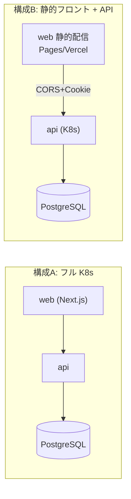
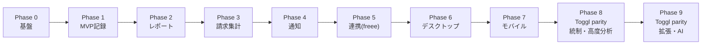

# PRD: マルチクライアント対応 稼働時間トラッカー

> ステータス: Draft v1.3（TDD方針反映済み） / 最終更新: 2026-07-20
> オーナー: katsunori_kuroda@neko-room.com

## 目次
1. 概要 / 背景・課題 / ゴール
2. ターゲットユーザー・ペルソナ・主要ユースケース
3. スコープ（In / Out）と MVP 定義
4. 機能要件（記録 / 階層・作業種別 / レポート・着地見込み / 請求・経費 / 通知 / 連携 / 生産性 / データ品質）
5. 非機能要件（オフライン同期 / 認証 / TZ / 監査・DR / 設定階層 / i18n / テスト・可観測性 / a11y / セキュリティ）
6. データモデル
7. アーキテクチャ（monorepo / 技術スタック / デプロイ）
8. ロール×権限マトリクス
9. ロードマップと受け入れ基準
10. 未決事項 / 将来検討

---

## 1. 概要 / 背景・課題 / ゴール

### 1.1 概要
複数のクライアント・複数案件にまたがる稼働時間を、レコード単位で「どのクライアントの
どの案件か」を明確に分けて記録・集計・請求できる稼働時間トラッカー。
小規模チーム（数名〜十数名）での利用を想定し、モバイル / デスクトップ / Web から
操作できる。まず **PWA を先行**して開発し、後続フェーズで **ネイティブアプリ**へ拡張する。
ネイティブの範囲は **デスクトップ（Windows / macOS、Tauri、フル機能 + トレイ常駐）を先に**、
続いて **モバイル（iOS / Android、React Native）**。いずれも `packages/core` と同一 API を共有する。

### 1.2 背景・課題
- 複数クライアント・複数案件を並行で進めると、どの時間がどの案件のものか曖昧になりやすい。
- スプレッドシート運用では、メンバー横断の集計・請求書化・記録漏れ防止が手間。
- 移動中や現場でも記録したいが、オフライン環境では既存ツールが使いにくい。
- 請求業務（時間 → 金額 → 請求書）まで一気通貫で繋げたい。

### 1.3 ゴール
- レコード単位でクライアント / 案件を必ず紐づけて記録できる（作業種別・タグは任意で補完）。
- タイマーと手動入力の両方で、PC・スマホ・タブレットから素早く記録できる。
- オフラインでも記録でき、オンライン復帰時に自動同期される。
- チームの稼働状況をダッシュボード・レポートで可視化し、**請求は freee 下書きまで**繋げられる。
- 将来のネイティブアプリ展開を見据え、ロジック・型を共有できる設計にする。
- 長期的には **Toggl Track 相当の機能カバレッジ**（記録ビュー、チーム管理、承認・ロック、Time Off、収益性、レポート共有・スケジュール、外部連携、ブラウザ拡張、AIインサイト）を段階的に取り込む。

### 1.4 非ゴール / MVP非対象
- 給与計算・法定勤怠管理そのもの。Toggl Track の Time Off Management 相当は、休暇・非稼働予定を記録率 / リマインダー / レポートから除外する補助機能として Phase 8 で扱う。
- ガント・チケット管理・本格的なプロジェクト進捗管理。Toggl Track の Tasks / Project templates / Recurring projects / Fixed fee projects 相当は、稼働集計・請求・レポートの補助階層として Phase 8 で扱う。
- 大規模マルチテナント SaaS としての課金プラン・セルフサインアップ最適化（初期は対象外）。
- MVPでは請求書の法定発行業務（番号採番・PDF・適格請求書の体裁・送付）は freee に委譲する。Toggl Track の invoice creation 相当は、Phase 8 で自前の請求ドラフト / エクスポート / 会計SaaS連携として扱う。
- 原価レート（社内コスト）・収益性（粗利）分析は MVP 非対象。Toggl Track の labor costs / profitability 相当は Phase 8 で扱う。

---

## 2. ターゲットユーザー・ペルソナ・主要ユースケース

### 2.1 ペルソナ
- **管理者（オーナー）**: チーム運営者。クライアント / 案件 / メンバー / レート / 請求を管理。
- **マネージャ**: 担当案件のメンバー稼働を把握し、案件の工数・予算を管理。
- **メンバー**: 自分の稼働時間を記録する実務担当者。リモート / 外出先からも記録。

### 2.2 主要ユースケース
- UC-1: メンバーがタイマーを開始し、案件を選んで作業、停止して記録を確定する。
- UC-2: メンバーが後から「14:00〜15:30 / A社 / サイト改修」を手動入力する。
- UC-3: 圏外でタイマー記録 → 電波復帰時に自動で同期される。
- UC-4: マネージャが今週の案件別・メンバー別の稼働をダッシュボードで確認する。
- UC-5: 管理者が月末に特定クライアントの billable レコードを集計し、freee 請求書の下書きを生成する。
- UC-6: 管理者が請求書を freee に下書きとして連携する。
- UC-7: メンバーが記録し忘れた日に、リマインダー通知を受け取る。
- UC-8: マネージャが案件の見積工数の超過アラートを受け取る。
- UC-9: メンバーが週次タイムシートを提出し、マネージャ / 管理者が承認・却下する。
- UC-10: 管理者が締め日以降の稼働記録をロックし、レポートの正確性を保つ。
- UC-11: 管理者がメンバーの労務コストを設定し、案件・タスク・クライアント別の収益性を確認する。
- UC-12: メンバーがブラウザ拡張や外部ツール上のボタンから、案件・タスク付きでタイマーを開始する。
- UC-13: 管理者がカスタムレポートを保存・共有・定期配信し、必要に応じて請求ドラフトへ変換する。
- UC-14: メンバーが Time Off を登録し、未記録リマインダーや稼働率集計から休暇日を除外する。

---

## 3. スコープ（In / Out）と MVP 定義

### 3.1 MVP（最初のリリース）
- **コア記録機能**: タイマー（開始 / 停止）+ 手動入力。
- クライアント / 案件 / タグの CRUD、レコードの一覧・編集・削除。
- 認証（メール&パスワード + OIDC SSO）、組織 / メンバー招待、3ロール権限。
- PWA としてインストール可能、**オフライン記録 → 同期**。
- **稼働レコードの CSV インポート**（既存スプレッドシート / 他ツールからの初期移行）。

### 3.2 後続フェーズ（Out of MVP）
- レポート / ダッシュボード / CSV・Excel エクスポート（Phase 2）。
- レート設定・billable 区別・請求書生成・freee 連携（Phase 3, 5）。
- リマインダー / 工数上限アラート（Phase 4）。
- カレンダー連携 / Slack 通知 / 会計 SaaS 連携（Phase 5）。
- ネイティブアプリ: **デスクトップ（Tauri / Win・macOS、Phase 6）→ モバイル（iOS・Android、Phase 7）**。
- Toggl Track parity 拡張: 承認・ロック・Time Off・労務コスト・収益性・固定費案件・高度レポート・ブラウザ拡張・AIインサイト（Phase 8 / 9）。

---

## 4. 機能要件

### 4.1 記録（タイマー + 手動入力）（Phase 1）
- タイマー: ワンタップで開始 / 停止。開始時に案件選択（直近利用案件をサジェスト）。
- 実行中タイマーは全画面・全デバイスで状態が見える（同期）。**1ユーザー1アクティブタイマー**（同時複数計測は不可。実行中に別タイマーを開始したら前のものを停止確定）。
- 手動入力: 開始 / 終了時刻、または所要時間（分）での入力。UI 上は所要時間だけのクイック入力（例: 30分 / 1h）を許すが、保存時は必ず `startAt` / `endAt` を持つ時間帯へ正規化する。既定は「終了=現在時刻、開始=終了-所要時間」。過去日を指定する場合は開始または終了のどちらかを補ってから保存する。
- 共通項目: クライアント・案件（必須）、作業種別（アクティビティ・任意）、タグ（任意・複数）、メモ、**参照 URL リンク（任意・複数。チケット / PR / ドキュメント等）**、billable フラグ、入力種別（timer / manual）。
- 記録の編集・分割・複製・削除。
- **必須は案件のみ**（案件さえ選べば記録可。メモ等は任意で素早く記録）。
- **案件の記録範囲**: 「公開（組織全員が記録可）/ アサイン限定（`ProjectAssignment` のメンバーのみ記録可）」を案件ごとに設定。同一案件に複数メンバーが関わる場合も両方式に対応。これは記録できる範囲のみを決め、他メンバーの稼働記録を読める範囲はロール×権限で別管理する。
- **メンバーの案件作成**: 組織設定で「メンバーもクライアント / 案件を作成可」を切替。許可時は記録中に **その場でクイック作成**（後で管理者が整理）。
- **時間の丸めは既定では行わない**（生の稼働レコードは実測のまま分単位で保持）。Toggl Track parity として Phase 8 で **レポート / 請求出力時の丸めルール**を追加するが、元レコードは変更しない。
- **入力動線（モバイル / PC 両対応）**:
  - **スマホ片手操作**: 親指の届く範囲・数タップでタイマー開始。
  - **ホーム画面クイックエントリー**: PWA のショートカット / ウィジェットから直接開始・再開。
  - **PC キーボード高速入力**: ショートカット / コマンドパレットで案件検索・記録を素早く。
- **タイマー UX**:
  - **クイック再開**: 直近停止した記録をワンタップで再開。
  - **アイドル検出**: **既定 10 分**（ユーザーで変更可）の操作なし / スリープを検知し、「まだ計測中か」「アイドル時間を破棄するか」をポップアップで確認（破棄 / 計上を選択）。
  - **ポモドーロ（任意）**: 既定 **25 分作業 / 5 分休憩**（変更可）。**休憩は稼働レコードに含めない**。使わない人は通常のタイマーのまま。
- **計測中の編集**: 走行中でも案件 / 作業種別 / メモを変更できる。
- **開始時刻の遡及修正**: 「10 分前に始めていた」を後から開始時刻調整できる。
- **複数端末同期**: PC で開始しスマホで停止、のように端末をまたいで同一タイマーを継続（サーバ正）。
- **日跨ぎ**: 夕方開始→翌日停止などは **分割せず 1 レコードのまま**保持（集計は開始日基準）。
- **重なり禁止**: すべての稼働レコードは保存時点で `startAt` / `endAt` を持つため、同一ユーザーの時間帯が重複する記録は **保存時バリデーションで不可**。所要時間入力も正規化後の時間帯で判定する。オフラインで検出できなかった重複は **同期時に検出**し、競合セット内で `updatedAt` が最も新しい変更を採用する（採用されなかった変更は正式データにせず、同期結果として通知）。
- **MVPでは承認・ロックフローを設けない**（請求前の確定ロックなし。いつでも編集可。送信履歴で二重送信のみ防止）。Toggl Track parity として Phase 8 で Timesheet approvals / Locked time entries / Required fields を任意設定として追加する。

### 4.2 階層・タグ（Phase 1）
- **クライアント > 案件** の2階層。レコードは案件に紐づく（→クライアントは案件経由で決定）。
- 案件は見積工数 / 予算 / 期間 / アクティブ状態を持つ。
- **タグ**は組織内で自由定義し、レコードに複数付与可能（例: 緊急 / レビュー）。アクティビティを補完する横断集計用のゆるい分類。

### 4.2.1 作業種別（アクティビティ）— 多階層 + テンプレート（Phase 1）
作業種別はレコードに1つ付与する構造化された分類軸で、集計・請求カテゴリにも使う。
**スコープを多階層**にし、上位を継承しつつ下位で上書き / 追加できる。

- **グローバル組み込みテンプレート**: システム提供の **汎用セット1つ**。初期セットは **9 種で確定**: **設計 / 開発 / レビュー / 会議 / 調査 / ドキュメント / テスト / 保守 / 管理・雑務**。新規組織はここから取り込んで開始できる。
- **登録スコープ（継承順）**: **グローバルテンプレート → 組織 → クライアント → 案件**。
  - 各スコープで種別を **追加** でき、上位から継承した種別を下位で **無効化（非表示）** もできる。
  - 例: 組織共通の「開発 / 会議」に加え、特定クライアントだけ「保守対応」、特定案件だけ「移行作業」を追加。社内会議が不要な案件では無効化。
- **種別の属性**: **色 / アイコン**（ダッシュボード・グラフでの識別）と **billable 既定値**（例「社内会議 = 非 billable」を記録時に自動セット、変更可）。
- **デフォルト種別**: スコープ（組織 / 案件）ごとに既定の作業種別を指定でき、新規記録時に自動セット（変更可）。
- **案件での絞り込み**: 限定（強制）はせず、案件でよく使う種別を **推奨として上位表示**するのみ（どの種別でも選択可）。
- 集計・レポート・freee 明細カテゴリの軸として利用。

### 4.3 レポート・集計（Phase 2）
- **ダッシュボード主要ビュー**:
  - **今週 / 今月の合計**（billable / 非 billable 内訳つき）。
  - **メンバー稼働一覧**（管理者 / マネージャ向け）。
  - **クライアント / 案件別の構成比**（円グラフ等）。
  - **見積消化ゲージ**（見積工数 / 予算に対する進捗バー）。
  - **稼働率（ユーティリゼーション）**: billable 時間 / 総稼働、目標稼働に対する達成率。
- **期間比較**: 前週比 / 前月比の増減・トレンドを表示。
- **トレンドグラフ**: **月次推移**（クライアント / 案件別の月ごとの稼働）、**billable 率の推移**、**クライアント構成比の推移**（比重の偏りの変化）を時系列で表示。
- メンバー別集計: 管理者 / マネージャがチームメンバーごとの稼働を確認。
- **週表ビュー（タイムシート）**: 週 × 案件のグリッドで一覧・手動入力・編集（横断的に素早く埋められる）。
- 周次 / 月次レポート: 定期サマリをアプリ内で自動生成・表示（**メール等への定期スケジュール配信はスコープ外**。週次サマリの Slack 投稿は 4.6 の連携で対応）。
- **エクスポート**: CSV / Excel(xlsx) で、**明細（生レコード）** と **集計（サマリ）** の両方を出力。**期間・クライアント・メンバー・タグでフィルタ**指定可能。経費も対象に含む。

### 4.3.1 月次着地見込み（フォーキャスト）（Phase 2 / 4）
月の途中で、その月の **着地見込み（このままのペースでの月末予測）** を表示する。
- **予測対象**: **総稼働時間** / **billable 金額** / **案件別見通し**（見積消化の着地）/ **メンバー別見通し**。
- **算出ロジック**: **稼働日ペースの線形外挿**を既定とする
  — `経過稼働日の実績 ÷ 経過稼働日数 × 月の総稼働日数`（**祝日・休日は除外**、組織の稼働日設定に従う）。
  実績のみで予測し、**カレンダー予定は加味しない**。
- **信頼度はレンジ（最小〜最大）で表示**: 「今月の経過実績ペース」と「直近数週の平均ペース」の両方から幅を出し、**最小〜最大の帯**で見せる。月初などデータが少ない時期は **「参考値」**と注記。
- **表示**:
  - **ダッシュボードカード**（今月の実績と着地見込みレンジを並記）。
  - **見積工数 / 月次上限 / ミニマム / 月次目標 に対して見込みを並記**（消化の着地が見える）。
  - **月次目標との比較**（週間目標の月版。達成見込みかを表示）。
  - **超過予測アラート**: 見込みが見積 / 上限を超えそうなら早期警告（**単一しきい値で 1 回**、4.5 の工数アラートと連動）。**通知先は本人（メンバー）と担当マネージャ**。
  - **週次サマリ**（Slack / メール）にも着地見込みを記載。

### 4.4 請求（自前は集計、発行は freee に委譲）（Phase 3 / 5）
- **方針**: 請求書そのもの（番号採番・PDF・適格請求書の体裁・送付）は **freee に委譲**し、本プロダクトでは保持しない。本プロダクトは **billable 集計** を持ち、freee へ **下書き** として渡す（UC-6）。
- レート: **組織 > クライアント > 案件**の単価に加え、**メンバー別レート**（役割 / ユーザー単位）も設定可。解決は「案件×メンバー > 案件 > クライアント > 組織既定」。**税抜で入力**し、**通貨**（複数通貨対応）・**税率**（消費税 10% / 8%）を保持して試算。
- **レートは適用開始日を持ち履歴管理**: 単価変更後も過去の記録は当時のレートで試算（遡及しない）。
- **ミニマムチャージ（月最低）**: 案件の **月次の最低請求**（時間 or 金額）を設定。スコープは **案件 > クライアント > 組織**で解決。
  - **実測記録は変えない**（丸めはしない）。月の billable が最低を下回る場合に **最低額で計上**する。
  - **集計・レポート表示にも反映**（請求だけでなくダッシュボードの billable 金額にも最低を適用）。
  - **月途中の開始 / 終了の日割りは設定で切替**（稼働日数に応じた按分の有無を案件ごとに選択）。
- billable / non-billable をレコード単位で区別。
- **freee 連携（下書き作成）**:
  - **接続単位は組織で1つ**: 管理者が一度 freee を OAuth 連携し、組織全体でその接続を共有。**標準の OAuth2 認可コードフロー + リフレッシュトークン自動更新**（トークンはサーバで安全に保持）。詳細スコープは実装時に freee API 仕様へ合わせる。
  - **源泉徴収・適格請求書（登録番号 / 端数 / 体裁）はすべて freee に委譲**（本ツールは税抜額を渡すのみで保持しない）。
  - **マスタ同期**: freee の **取引先一覧を取得**して `Client` にマッピング（候補サジェスト + 手動確定）。未マッピングは送信前に検出してブロック。
  - 集計対象を選び、freee の請求書 **下書き** を作成（適格請求書番号の採番・登録番号・最終的な税計算は freee 側に委ねる）。
  - **まとめ単位はユーザーが都度選択**（クライアント / 案件 / 期間 / 明細単位の組み合わせ）。
  - **明細行の粒度も生成時に選択**（案件単位で集約 / 作業種別単位 / 日別 など）。
  - 二重送信防止のため、送信記録（freee 下書き ID・対象 TimeEntry / Expense・送信日時）を保持。送信済みレコード / 経費は再送対象から除外。
- **生成のトリガー（両対応）**:
  - **手動**: 管理者が「下書き生成」を実行（いつでも）。
  - **締日に自動**: クライアントの締日に下書きを自動生成し、管理者が確認。
- **明細の品目名 / 表現**:
  - **品目名は可変テンプレート差込**で自動生成（例: `{案件名} {期間} 作業費`。利用可能な差込子: 案件 / クライアント / 期間 / 作業種別 等）。
  - **数量 × 単価表現**: Phase 3 / 5 では **「時間(h) × 時給」**で明細化（時間課金を優先）。Toggl Track parity として Phase 8 で fixed fee / recurring projects / retainers 相当の固定費・定期予算を追加する。
- **送信前プレビュー / 編集**:
  - 生成される **明細・金額を送信前にプレビュー**。
  - 本ツールでの編集は **行の統合 / 除外・品目名・個別メモ**まで。**値引き・調整（マイナス行）は freee 側で行う**（本ツールには持たない）。
- **エラー処理**:
  - **トークン失効**時は管理者に **再連携を促す**。
  - **未マッピング**（取引先未紐付け）を事前検出してブロック。
  - **送信ログ**を保持し、部分失敗は **再試行**可能。
- **請求対象期間の選び方**:
  - **月次締め**（月末 / 任意締日）、**任意期間**（開始〜終了を手動指定）、**マイルストーン単位**（案件の納品 / フェーズ）。
  - **クライアントごとの締日**を設定し、月次締めに自動適用。
  - **基本は「1 クライアント × 期間 = 1 請求」**（マイルストーン等で分けたい場合のみ複数化）。
  - **期日・請求日は freee の既定（取引先設定）に任せる**（本ツールでは指定しない）。
- **freee への動線**: 下書き作成後、`freeeDraftId` から **freee の該当下書きを開くディープリンク**を表示（仕上げは freee で行う）。
- **フォールバック**: 請求は **freee 連携前提**（freee 以外への請求書フォールバック出力は持たない。記録 / 集計の CSV エクスポートは別途あり）。
- **送信後の編集**: freee 送信済み期間の元レコードを後から編集したら、**「請求と差異あり」と警告**し、再送 / 手当てを促す（自動上書きはしない）。
- **請求ステータスの追跡は最小**: 本ツールは各レコード / 期間が **「freee 送信済みか否か」**のみ管理（入金・確定などの進捗管理は freee 側）。
- **請求の監査**: 送信履歴・再送履歴・送信後の差異記録を保持（誰がいつ何を freee に送ったか追跡可能）。送信履歴は元 `TimeEntry` / `Expense` への参照だけでなく、送信時点の明細スナップショット（品目名、メモ、数量、単価、通貨、税区分、税抜金額、対象期間、集約元ID一覧、freee 送信 payload / response 要約）を保持し、元レコードが後から編集されても当時の送信内容を復元できるようにする。
- **通貨は換算しない**: 各案件の通貨のまま集計・送信。複数通貨が混在するレポートは **通貨別に分けて表示**（基準通貨への換算はしない）。
- **金額の丸め・端数・税の最終計算は freee に委ねる**（本ツールは試算のみ）。
- 自前で持つのは「何をいくらで freee に渡したか」の **送信時点スナップショット付き送信履歴** のみ。請求書 PDF・freee 側で最終調整された確定金額の正は freee。

### 4.4.1 経費（Expense）（Phase 3 / 5）
- **経費を記録**し、稼働時間と並べて集計・請求できる。
- **紐付け**: 経費は **案件 または クライアント直下**のどちらにも紐づけられる（両方許容）。
- **属性**: **税込金額**で入力（税の最終計算は freee）、通貨、日付、説明、**請求可否（billable / 立替か社内経費か）**、**領収書 URL**（Google Drive 等のリンク参照。ファイル実体は持たない）。
- **freee 連携**: **billable な経費は freee 下書きの明細行に追加**（作業費の明細と並べて 1 請求に含める）。送信履歴・二重送信防止は作業費と同様に扱う。
- **記録権限**: 組織設定で「メンバーも経費を登録可」を切替（許可時は自分の立替経費を登録、管理者が確認）。
- **Phase 3では承認フローなし**（稼働と同様にロック / 承認は設けない。送信履歴で二重送信のみ防止）。Toggl Track parity として Phase 8 で経費を含むタイムシート承認・ロックとの整合を追加検討する。
- **通貨**: 経費は **案件の通貨に揃えて入力**（自動換算はしない＝支払通貨が違う場合は手動で換算して入力）。
- マークアップ（上乗せ）・経費カテゴリの細分化・経費専用レポートは当面スコープ外（将来検討）。

### 4.5 通知・リマインダー（Phase 4）
- **通知チャネル**: アプリ内 / **PWA プッシュ（Web Push）** / メール / Slack（チャネルはユーザー設定で選択）。
- **記録し忘れリマインダー** の検知トリガー:
  - **稼働日の未記録**: 稼働日（曜日設定）に記録 0 件なら通知。**日本の祝日は自動取得して稼働日判定から除外**（休日扱い）。
  - **タイマー出しっぱなし**: 長時間走りっぱなしのタイマーを検知して警告。
- **工数上限アラート** の基準（**しきい値は案件ごとに可変**）:
  - **見積工数比**: 案件の見積時間に対する消化率（例 80% / 100%）。
  - **予算（金額）比**: 案件予算額に対する billable 金額の消化率。
  - **月次上限**: クライアント / 案件の月次上限時間の超過。
  - **着地見込み超過（予測）**: 月次着地見込み（4.3.1）が見積 / 上限を超えそうな場合に **実超過前に**警告。
- **通知タイミング**: 未記録リマインダーは **稼働日の終業時刻（既定 18:00 目安、組織設定で変更可）** に送信。**静穏時間（既定 夜間 21:00〜翌 8:00 / 休日）はプッシュを抑止**し、翌営業開始にまとめる。ユーザーごとに静穏時間・送信時刻を上書き可能。

### 4.6 外部連携（Phase 5）
- **カレンダー連携（読取りのみ）**: Google カレンダー等の予定を取り込み（カレンダーには書き戻さない）。
  - **案件推定は「キーワード一致」**（予定タイトル等のキーワードで案件を推定）→ ルールで下書き化 → **ユーザーが確認して確定**。
  - **取り込み範囲 / 除外**: 辞退済みの予定を除外、**特定カレンダーのみ**対象、終日 / 非業務の予定を除外。
- **Slack 連携（双方向）**:
  - **通知**: リマインダー（未記録 / タイマー放置）・工数アラート。
  - **週次サマリ投稿**: チーム / 個人の週次稼働サマリを定期投稿。
  - **Slack から記録**: `/track` 等のコマンドでタイマー開始 / 停止。
- 会計 SaaS 連携: **freee（請求書下書きの作成）を第一優先**。マネーフォワード等は将来検討。
- いずれの外部サービスとの同期も **読取りのみ**を基本とする（freee への下書き作成を除く）。

### 4.7 生産性・入力補助（Phase 1 / 2 / 6 / 7）
- **最近の案件サジェスト**: タイマー開始時に直近・高頻度の案件を上位表示。
- **お気に入り / テンプレート**: よく使う「案件 × 作業種別（× メモ）」の組み合わせを保存し、ワンタップ記録 / 即タイマー開始。
- **週間 / 月次目標 / ペース**: 週・月の目標時間を設定し、進捗・残ペース・達成見込みを表示。
- **端末ごとの既定クライアント / 案件**（ネイティブ）: デバイス単位で既定の案件を指定し、その端末では迷わず即記録（例: 現場用タブレットは常に特定案件）。

### 4.7.1 検索・フィルタ（Phase 2）
- **全文検索**: メモ本文を横断検索。
- **多軸フィルタ**: 期間 / クライアント / 案件 / 作業種別 / タグ / メンバー / billable で絞り込み。
- **保存フィルタ**: よく使う条件を保存して再利用（レポート・一覧・エクスポートで共通）。

### 4.7.2 一括操作（バルク）（Phase 2）
- **一括削除 / 復元**（論理削除と取消）。
- **一括 billable 切替**（期間をまとめて請求可否変更）。
- **一括再割当**（複数レコードの案件 / タグをまとめて変更）。

### 4.7.3 案件のライフサイクル（Phase 1）
- 案件状態は **アクティブ / アーカイブ** の 2 状態。アーカイブは新規記録の選択肢から外すが、過去記録・集計・請求履歴は保持。
- **削除ガード**: 紐づく記録があるクライアント / 案件は **削除でなくアーカイブを推奨**（論理削除は可能だが、影響範囲を警告してから実行）。

### 4.8 データ品質チェック（Phase 1 / 2）
- **未分類 / 要修正一覧**: 未分類案件への再割当待ち・重なり・極端に長い / 0 分などの **要対応レコードを集約**して解消へ誘導（5.7.1 と連動）。
- **不自然検知**: 24 時間超 / 0 分 / 未来日付などを検知して警告。
- **月次クローズ推奨**: 月末に「請求前の確認チェックリスト」を提示（ロックはしない＝任意の手続き）。

### 4.9 Toggl Track parity 機能（Phase 8 / 9）
参考: [Toggl Track Help Center の Features カテゴリ](https://support.toggl.com/features)（Time Tracking / Data & Team Management / Analyzing Time & Reporting / Single Sign On）と [Toggl Track Features ページ](https://toggl.com/track/features/) をカバレッジ元にする。

| Toggl Track機能群 | 取り込み方針 | Phase |
|---|---|---|
| Time Tracking Goals | 個人 / チーム / 案件 / billable目標として `Goal` を拡張。週次・月次・任意期間に対応。 | 2 / 8 |
| Timesheet View / List View / Timer Page / Manual Mode / Timer Mode / Calendar View | MVPの記録画面を土台に、週表・リスト・タイマー・カレンダーを同じ `TimeEntry` モデルの複数ビューとして提供。 | 1 / 2 |
| Pomodoro timer | 既存の任意ポモドーロ機能として提供。モバイル / デスクトップでも同じ設定を共有。 | 1 / 7 |
| Timeline | デスクトップ / ブラウザ拡張でアプリ・URL活動を自動記録候補として収集。本人だけが見えるプライベート候補とし、採用時だけ稼働レコード化する。 | 8 / 9 |
| URLからのタイマー開始 | URL query / deep link / browser extension message から案件・作業種別・メモ・参照URLを事前入力してタイマー開始。 | 5 / 9 |
| Favorites / Templates | `EntryTemplate` として個人・チームのお気に入りを固定表示し、ワンクリック開始に使う。 | 1 / 8 |
| Shared time entries / Add time for team | 共同作業の共有エントリー、または管理者による代理追加を提供。本人承認または監査ログ必須。 | 8 |
| Teams / user groups | `Team` を追加し、権限・レート・レポート・タスク割当の単位として使う。 | 8 |
| Admin Console / member profile management / access rights | 管理者向けコンソールでメンバー、ロール、チーム、SSO、座席、権限を一括管理。 | 0 / 8 |
| Time Off Management | 休暇・非稼働予定を持ち、記録率・リマインダー・稼働率・Workload Reportから除外できるようにする。給与計算や有給残数管理は対象外。 | 8 |
| Time tracking reminders / Team reminders | 個人リマインダーに加えて、日次・週次目標未達のチームリマインダーを追加。 | 4 / 8 |
| Required fields | 案件 / タスク / タグ / メモなどを組織・チーム・案件単位で必須化できるルールを追加。 | 8 |
| Locked time entries | 締め日・承認済み期間・任意ロック期間後の編集を禁止。管理者例外と監査ログを持つ。 | 8 |
| Timesheet Approvals / Multi-Layer Approval / Timesheet statuses | 週次タイムシート提出、承認 / 却下 / コメント、多段承認、ステータス管理を追加。 | 8 |
| Projects / Clients / Tags | 既存のクライアント・案件・タグ管理をToggl相当の基本マスタとして維持。 | 1 |
| Tasks (sub-projects) | `Task` を案件配下の任意階層として追加。作業種別とは別に、案件内の納品物・小タスク別集計に使う。 | 8 |
| Project estimates / Alerts / Project Dashboard | 見積工数・予算・上限・着地見込み・アラートを案件ダッシュボードで統合。 | 2 / 4 / 8 |
| Recurring Projects / Fixed Fee Projects / Project templates | 定期リセットされる見積・固定費・リテーナー・案件テンプレートを追加。 | 8 |
| Billable rates / Historical billable rates | 既存 `Rate` を拡張し、workspace / team member / project / project member / task 粒度の履歴レートへ対応。 | 3 / 8 |
| Labor costs / Profitability | `CostRate` を追加し、収益・コスト・粗利をプロジェクト / タスク / クライアント / メンバー / チーム単位で表示。 | 8 |
| Summary / Detailed / Workload / Profitability / Project Dashboard reports | 既存レポートにWorkload・Profitability・Project Dashboardを追加し、Toggl相当のレポート体系へ拡張。 | 2 / 8 |
| Filters / Date Range / My Reports / Custom charts | 保存フィルタ、相対日付、カスタムレポート、チャートビルダーを追加。 | 2 / 8 |
| Rounding / Global Report Settings | レポート・請求出力時だけの丸め、表示単位、週開始日、タイムゾーン、billable表示などのグローバル設定を追加。 | 8 |
| Time audits / Team member audits | 未記録、短すぎる / 長すぎる記録、必須項目欠落、目標未達を監査ビューで検出。 | 2 / 8 |
| Saving, Sharing and Scheduling Reports | レポートの保存、共有リンク、定期メール配信、公開範囲管理を追加。 | 8 |
| Creating Invoices | freee下書き連携に加え、Toggl相当の請求ドラフト、PDF / CSV / 会計SaaS送信、送信履歴を追加。法定請求書の正は会計SaaS優先。 | 8 / 9 |
| AI Insights | レポートデータから異常・傾向・改善候補を生成する。根拠レポートを明示し、データは自動変更しない。 | 9 |
| SSO / advanced SSO / provider setup | 汎用OIDCに加え、Entra ID / Google Workspace / Okta / OneLogin の設定テンプレート、SSO-only、JIT、ドメイン制限を提供。 | 0 / 8 |
| Mobile / Desktop / Web apps / WatchOS | Web PWA、Tauri、React Nativeに加え、必要ならWatchOS companionをPhase 9で検討。 | 1 / 6 / 7 / 9 |
| Browser extensions / 100+ integrations | Chrome / Firefox / Edge 拡張を提供し、主要Webツール上にタイマーボタンを埋め込む。 | 9 |
| API & Webhooks | Phase 5の公開APIを拡張し、レポート、プロジェクト、タスク、承認、WebhookイベントをToggl相当に広げる。 | 5 / 9 |
| Google / Outlook Calendar | 読取り連携とカレンダービュー表示に加え、予定から稼働レコード候補を作成。 | 5 |
| Toggl Plan / Jira / Salesforce / QuickBooks / Zapier / Make 相当 | 直接実装する連携と automation connector を分ける。日本向けは freee を優先しつつ、QuickBooks相当の会計連携口も抽象化する。 | 9 |

---

## 5. 非機能要件

### 5.1 オフライン同期
- **ローカル保持は軽量方針**: IndexedDB に保持するのは **進行中の計測 + 未同期の変更（およびマスタ: 案件 / アクティビティ / タグ）** のみ。過去の確定済みレコードはオンライン取得（必要分のみキャッシュ）。
- オフライン時は **新規記録・進行中計測・直近キャッシュの閲覧** が可能。同期完了後はローカルの確定済みデータを保持し続けない（容量を抑える）。
- 同期エンジン: クライアント生成 UUID + `updatedAt` + tombstone（`deletedAt`）による push / pull。
- 競合解決: 小規模運用のため **last-write-wins**（LWW、`updatedAt` 比較）を基本とする。同一レコード編集だけでなく、重複時間帯・二重アクティブタイマーの競合にも適用し、同一ユーザー内の競合セットで最も新しい変更を採用する。
- 実行中タイマーはサーバ正をソースに、復帰時に整合を取る。二重アクティブタイマーが発生した場合は LWW で採用するタイマーを決定し、古い端末側タイマーは正式データにせず、同期結果として通知する。
- **孤児レコードの扱い**: オフライン中に削除された案件へ記録してしまった場合も **記録は破棄しない**。
  - 組織ごとに削除不可・請求対象外のシステム案件「**未分類**」を自動作成する。
  - 同期時に参照先案件が削除済みで通常表示に戻せない場合、稼働レコードは「未分類」案件へ自動再割当する。これにより `TimeEntry.projectId` は常に必須のまま保つ。
  - 「未分類」案件の稼働レコードは請求集計から除外し、要再割当として一覧化する。ユーザーが有効な案件へ再割当すると通常の集計・請求対象に戻る。
- **データ保持**: レコード・監査ログともに **無期限保持**（自動アーカイブ / 自動削除は行わない）。削除はユーザー操作による論理削除のみ。

### 5.2 認証・権限
- メール&パスワード + OIDC SSO の両対応（Auth.js / Credentials + OIDC プロバイダ）。認証処理は `apps/api` が **認証BFF** として保持し、Web / PWA は API の `/auth/*` エンドポイントへリダイレクトする。
- **Web セッション**: `apps/api` が Credentials / OIDC callback を処理し、Web / PWA 向けに HttpOnly / Secure / SameSite Cookie セッションを発行する。静的フロント構成でもログイン処理は API 側で完結させる。
- **CORS / CSRF**: フロントと API を別ホストにできるよう、許可済み origin のみ credential 付き CORS を許可し、状態変更系は CSRF 対策を必須にする。
- **ネイティブ / 公開 API 認証**: デスクトップ・モバイル・公開 API 向けのトークン方式は後続フェーズで追加する。MVP の Web 認証とは責務を分け、パスワードや OIDC トークンをクライアント側で直接保持しない。
- **OIDC プロバイダ**: 汎用 OIDC（任意プロバイダを設定可能）を基本とし、**Microsoft Entra ID** と **Google Workspace** を主要サポート対象とする。
- メンバー招待はメールリンク方式。加えて **SSO ジャストインプロビジョニング**（許可された IdP で初回ログイン時にユーザーを自動作成）。
- **招待管理**: 招待リンクに **有効期限**、未承諾の **再送 / 取消**、組織の **座席（シート）上限**管理。
- **複数組織所属**: 1 ユーザーが複数組織に所属でき、UI で組織を切替（`Membership` で設計済み）。
- ロール×権限はセクション8の通り（ロールは所属組織ごと）。

### 5.3 タイムゾーン
- 想定は **国内中心 + 将来海外**。レコードの時刻は **UTC で保持**し、表示・集計は **ユーザー TZ** で行う。
- ユーザー / 組織ごとに TZ を保持し、将来の海外メンバーにフル対応できる設計とする（当面の既定は JST）。
- **集計の日境**: 個人の表示・集計は **記録者の TZ** で「その日」を判定。一方 **請求集計は組織の基準 TZ** で日境をそろえ、請求の一貫性を担保する（TZ が混在するチームでの二重基準を明示）。
- **サマータイム（DST）**: IANA タイムゾーンデータベースに従い、UTC 保持 + TZ ライブラリで自動吸収（個別対応は不要）。

### 5.4 監査・データ保持・削除
- **変更履歴ログ（監査ログ）**: レコード / 案件 / レート等の作成・編集・削除を「誰が・いつ・何を」記録。
- **論理削除**: 削除は tombstone（`deletedAt`）によるソフトデリートとし、同期と整合・復元可能に。
- **退会時エクスポート**: メンバー / 組織のデータを一括エクスポートできる（退会・解約時のデータ持ち出し）。
- **退会メンバーの記録**: 本人アカウントは無効化するが、**過去の稼働・請求記録は組織に保全**（集計・請求の整合を維持。表示は「退会済み」扱い）。

### 5.4.1 バックアップ・復旧（DR）（Phase 0 / 5）
- **定期 DB バックアップ**: 自動バックアップとリストア手順を整備（取得頻度・保持世代を運用で定義）。
- **外部ストレージへの自動バックアップ（オプション）**: 組織の **Google Workspace 共有ドライブ** / **OneDrive for Business（SharePoint）** に、エクスポート（CSV / アーカイブ）を **定期自動保存**する機能。組織が自分のクラウドに控えを持てる。
- 補助的に、オフライン同期の性質上、各端末にも未同期データのローカルコピーが残る。

### 5.4.2 設定の階層
- 設定は **組織 > クライアント > 案件 > 個人** の 4 階層で継承・解決する。
- 階層継承する主な設定: **レート / 作業種別 / ミニマムチャージ**（組織〜案件）、**通知・表示の好み**（個人）。
- 下位が未設定なら上位を継承、下位で上書き可能。

### 5.5 国際化（i18n）
- 当面の UI は **日本語のみ**、通貨は円中心（外貨は請求データとして保持）。
- ただし将来の海外メンバー向けに **i18n 基盤（メッセージ外部化・ロケール切替の仕組み）だけは最初から用意**する。

### 5.6 テスト・品質
- **開発プロセスは TDD を標準**とする。各機能は、受け入れ基準から最小の振る舞いを1つ選び、RED（失敗するテスト）→ GREEN（通す最小実装）→ REFACTOR（振る舞いを保った整理）の順で進める。
- テストは **実装詳細ではなく公開インターフェースの振る舞い**を検証する。`packages/core` のドメインAPI、`apps/api` のREST API、`apps/web` の主要ユーザーフローをテスト境界とし、private関数や内部 collaborator の呼び出し順には依存しない。
- **水平スライスは禁止**: 先に全テストを書き切ってから全実装する進め方はしない。1つの受け入れシナリオごとに、テスト→実装→リファクタを縦に通す。
- **ユニット + 結合 + E2E** を基本とし、特に **オフライン同期・競合解決（LWW）・重複 / 二重アクティブ時の採用結果通知・孤児レコード処理** を重点的にテスト（`packages/core` のドメインロジックをカバレッジ重視で検証）。
- freee 連携・集計金額・税率計算はAPI結合テストで検証し、外部APIは境界アダプタで置き換え可能にする。freee本体の挙動ではなく「送るpayload」「保存する送信履歴」「失敗時の再試行可能性」を検証する。
- UIは主要フローのみE2Eで検証する（ログイン、タイマー開始/停止、手動入力、同期状態表示、CSVインポート、レポート出力）。細かな表示条件はコンポーネントまたはAPI結合テストへ寄せる。
- CI でビルド / lint / テスト / コンテナイメージ生成を自動実行（Phase 0 基盤）。mainへ入る変更は、関連する受け入れ基準のTDDサイクルがGREENであることを必須にする。

#### 可観測性
- **エラー監視**（Sentry 等）でクラッシュ / 例外を収集。
- **稼働メトリクス**（API 応答時間・同期成功率・キュー滞留など）を公開・監視。
- 利用分析を行う場合も記録内容には踏み込まず、最小限の匿名指標に留める。

### 5.7 アクセシビリティ・UI
- 目標水準 **WCAG 2.1 AA 相当**: キーボード操作、適切なコントラスト、フォーカス可視化、スクリーンリーダ対応（記録の開始 / 停止など主要操作）。
- **ダーク / ライトテーマ**対応（システム設定追従 + 手動切替）。
- **ブランディングは シンプル・中立**（作業ツールらしい落ち着いた配色、アクセント 1 色）。派手な装飾は避ける。
- **表示設定（個人 / 組織）**: **時間表記の切替**（`1:30` ⇄ `1.5h`）、**週の始まり曜日**、**数値・通貨書式**（桁区切り / 通貨記号）、**一覧のコンパクト表示**（行間密度）。
- モバイル / デスクトップで操作しやすいレスポンシブ UI、タッチターゲット確保。

### 5.7.1 空状態・エラー UX（丁寧に）
- **初回オンボーディング**: 組織作成 → クライアント / 案件 → 最初の記録、までを案内する **セットアップチェックリスト**（進捗が見える）。**作業種別テンプレートの取り込み**を最初に提示。
- **空状態**: 記録 0 件 / 案件未作成などで、次にやるべきアクションを示す（「最初の案件を作る」「タイマーを開始」）。
- **同期状態の可視化**: 「同期済み / 未同期 N 件 / 同期中 / 同期失敗」を常時わかる形で表示。
- **オフライン表示**: オフライン中であることと、ローカル保存されている旨を明示（記録は失われないと安心させる）。
- **アプリ更新**: 新バージョン検知時に **「更新します」と通知して再読込**（Service Worker の更新フロー。計測中データは失わない）。
- **同期失敗・競合**: 失敗理由と再試行、重なり / 孤児レコードなどの **要対応項目を一覧化**して解消へ誘導。
- **エラー全般**: 復旧手段を伴う分かりやすいメッセージ（無言の失敗を作らない）。

### 5.8 セキュリティ
- **セッション管理**: ログイン中端末の一覧表示と遠隔ログアウト、セッション失効。
- **2 要素認証（2FA）**: メール&PW ログインに TOTP 等の 2FA をオプション提供。
- **レートリミット**: 認証・API への過剰リクエストを制限。
- **監査**: 認証イベント（ログイン / 失敗 / トークン更新）を監査ログに記録。
- 組織単位のデータ分離、最小権限、通信 TLS、保存時の機微情報保護。
- **データ保存リージョン**: 特段の地域要件なし（コスト / 可用性優先）。将来顧客要求が出た場合に再検討。

### 5.9 その他
- パフォーマンス: 記録の開始 / 停止は体感即時。一覧は仮想化・ページング。
- **マルチテナント余地**: 当面は自チーム利用だが、**将来の他組織提供を視野**に、`Organization` 単位のデータ分離を最初から徹底する（セルフサインアップ・プラン課金は将来検討）。
- 可用性: PWA はオフラインでも基本操作可能。サーバ障害時もローカル記録は継続。デプロイは Docker / Kubernetes 前提（ステートレス・水平スケール・ローリングアップデート、詳細は7.4）。

---

## 6. データモデル

### 6.1 主要エンティティ
- `Organization`: テナント（チーム）。
- `User`: 利用者アカウント。
- `Membership`: org × user × **role**（admin / manager / member）。**1 ユーザーが複数組織に所属可能**。
- `Team` / `TeamMembership`: 組織内のユーザーグループ。権限、レート、タスク割当、レポート、チームリマインダーの単位に利用。
- `Session`: ログインセッション（端末情報 / 失効）。`UserCredential`: パスワード / 2FA(TOTP) シークレット / OIDC 連携。
- `OrganizationSetting`: 組織設定（週の始まり曜日 / 稼働日・休日 / 既定通貨 / 時間表示単位 / 既定 TZ / **日本の祝日自動除外** / メンバーの案件作成可否 / メンバーの経費登録可否 / 座席上限 / SSO-only / 必須項目ルール / レポート丸め設定）。
- `EntryTemplate`: お気に入り / テンプレート（案件 × 作業種別 × メモ等の保存セット）。
- `Goal`: ユーザー（/ チーム）の目標時間。**週次 / 月次**の期間を持ち、目標比較・着地見込み比較に利用。
- `SavedFilter`: 保存した検索 / フィルタ条件（一覧・レポート・エクスポート共通）。
- `DeviceSetting`: 端末ごとの既定クライアント / 案件（ネイティブ）。
- `Client`: クライアント（org 配下）。**`freeePartnerId`**（freee 取引先 ID）/ **締日**（請求月次締め用）を保持。
- `Project`: 案件（client 配下）。見積工数 / 予算（金額）/ 月次上限 / **月次ミニマムチャージ（時間 or 金額）** / アラートしきい値（%）/ 期間 / アクティブ状態 / **記録範囲**（公開 = 組織全員が記録可 / アサイン限定 = `ProjectAssignment` のメンバーのみ記録可）/ `isSystem` / `systemKind`(unclassified) を保持。ミニマムは Client / Organization にも設定でき階層解決。システム案件「未分類」は組織ごとに1つだけ作成し、削除不可・請求対象外・通常の案件選択候補外とする。
- `Task`: 案件配下の任意サブ階層（Toggl Track の Tasks 相当）。作業種別とは別軸で、納品物・小タスク別の見積 / 実績 / レポートに利用。
- `ProjectTemplate`: 案件テンプレート。既定タスク、見積、レート、必須項目、記録範囲、アラート設定を複製する。
- `ProjectBillingProfile`: fixed fee / recurring estimate / retainer / hourly など、案件の請求・予算タイプと期間リセット設定を保持。
- `Milestone`: 案件のマイルストーン（納品 / フェーズ）。マイルストーン単位の請求対象に利用。
- `ProjectAssignment`: 案件 × ユーザー（マネージャ / メンバー等のアサイン）。マネージャの「担当案件」範囲と、アサイン限定案件で記録できるメンバー範囲を決定する。アサインは他メンバーの詳細稼働記録閲覧権限をメンバーへ付与しない。
- `NotificationPreference`: ユーザー × チャネル（in-app / push / email / slack）× 種別（リマインダー / アラート）の購読設定。
- `Activity`: 作業種別。**`scope`**(global / org / client / project) + 任意の `clientId` / `projectId` + `parentId`（継承元）を持ち、上位を継承しつつ下位で追加。`color` / `icon` / `defaultBillable` 属性、各スコープの既定指定 `isDefault`、案件での推奨フラグを持つ。
- `ActivityOverride`: 下位スコープでの上位種別の **無効化（非表示）** 指定（scope + 対象 activityId）。
- `Tag`: org 内自由タグ。`TimeEntryTag`: レコード×タグの中間（複数付与）。
- `TimeEntry`: レコード。`user` / `project`（必須。孤児化時はシステム案件「未分類」へ再割当）/ `startAt` / `endAt` / `durationMinutes`（`startAt` / `endAt` から算出または検証）/ メモ / `billable` /
  `source`(timer | manual) / 同期メタ(`uuid`, `updatedAt`, `deletedAt`)。
- `SharedTimeEntry`: 共同作業・代理追加のための共有エントリー。対象ユーザー、承認状態、生成元 `TimeEntry`、監査情報を保持。
- `TimelineActivity`: デスクトップ / ブラウザ拡張が収集するアプリ・URL活動候補。本人のみ閲覧可能で、採用時に `TimeEntry` へ変換する。
- `RequiredFieldRule`: 組織 / チーム / 案件単位の必須項目ルール（project / task / tag / memo 等）。
- `TimeLockRule`: 締め日、承認済み期間、任意日付に基づく編集ロック設定。
- `Timesheet`: ユーザー × 週次期間の提出単位。対象 `TimeEntry`、提出状態、ロック状態を保持。
- `TimesheetApproval`: Timesheet に対する承認 / 却下 / コメント / 多段承認ステップ。
- `TimeOff`: ユーザーの休暇・非稼働予定。リマインダー、記録率、Workload、稼働率集計からの除外に利用。
- `Rate`: 時間単価（**税抜で入力**）。**通貨** / **税率** / **`effectiveFrom`（適用開始日）** を保持。**適用粒度は 案件 > クライアント > 組織既定**で解決し、加えて **メンバー別（役割 / ユーザー単位）レート**も設定可（案件×メンバーが最優先）。レートは適用期間を持ち、**各 `TimeEntry` はその日時に有効なレート**で試算（過去分は遡って変わらない）。
- `CostRate`: 労務コスト単価。workspace / team / member / project member / task 粒度と適用期間を持ち、Profitability Report の原価計算に使う。
- `ReportDefinition` / `ReportSchedule` / `ReportShareLink`: カスタムレポート、保存条件、共有リンク、定期配信設定を保持。
- `RoundingRule`: レポート / 請求出力時だけに適用する丸め設定。元 `TimeEntry` は変更しない。
- `BillingExport` + `BillingExportLine`: **freee 送信履歴**（請求書そのものは持たない）。`freeeDraftId` / `status`(draft 作成 / 成功 / 部分失敗 / 失敗) / 送信日時 / まとめ単位・明細粒度 / 対象期間 / エラーログを保持。`BillingExportLine` は対象 `TimeEntry` **または `Expense`** を参照しつつ、送信時点の明細スナップショット（品目名、メモ、数量、単価、通貨、税区分、税抜金額、集約元ID一覧、freee payload / response 要約）を不変に保持する。二重送信防止・再試行・送信後差異検出に使用。
- `InvoiceDraft`: Toggl Track parity の自前請求ドラフト。PDF / CSV / 会計SaaS送信用の出力単位で、法定請求書の正は連携先会計SaaSに置く。
- `Expense`: 経費。`projectId` または `clientId`（両方許容）/ **税込金額** / 通貨 / 日付 / 説明 / **billable**（立替請求 or 社内経費）/ **領収書 URL**。billable 経費は `BillingExportLine` 経由で freee 明細に追加。
- `AuditLog`: 監査ログ（actor / 対象エンティティ / 操作種別 / 変更前後 / 日時）。
- `ActiveTimer`: ユーザーごとの実行中タイマー（**1ユーザー1件**、project / 開始時刻）。

### 6.2 関係（ER概要）

```mermaid
erDiagram
    Organization ||--o{ Membership : "所属"
    User         ||--o{ Membership : "複数組織所属可"
    Organization ||--|| OrganizationSetting : "設定"
    User ||--o{ Session : ""
    User ||--o{ UserCredential : ""
    User ||--o{ Goal : "週次/月次"
    User ||--o{ DeviceSetting : ""
    User ||--o{ EntryTemplate : ""
    User ||--o{ NotificationPreference : ""
    User ||--o| ActiveTimer : "1人1件"
    User ||--o{ TimeOff : ""
    User ||--o{ Timesheet : ""

    Organization ||--o{ Team : ""
    Team ||--o{ TeamMembership : ""
    User ||--o{ TeamMembership : ""
    Organization ||--o{ Client : ""
    Client       ||--o{ Project : ""
    Project      ||--o{ Task : ""
    Project      ||--o{ ProjectTemplate : ""
    Project      ||--o{ ProjectBillingProfile : ""
    Project      ||--o{ TimeEntry : ""
    Task         ||--o{ TimeEntry : ""
    User         ||--o{ TimeEntry : "記録者"
    TimeEntry    ||--o{ SharedTimeEntry : ""
    User         ||--o{ TimelineActivity : "候補"
    Project      ||--o{ Milestone : ""
    Project      ||--o{ ProjectAssignment : ""
    User         ||--o{ ProjectAssignment : "アサイン"

    Organization ||--o{ Rate : "組織既定"
    Client       ||--o{ Rate : ""
    Project      ||--o{ Rate : "案件/メンバー別"
    Organization ||--o{ CostRate : ""
    Project      ||--o{ CostRate : ""
    Organization ||--o{ RequiredFieldRule : ""
    Organization ||--o{ TimeLockRule : ""
    Timesheet    ||--o{ TimesheetApproval : ""

    Organization ||--o{ Activity : "scope=org/global"
    Client       ||--o{ Activity : "scope=client"
    Project      ||--o{ Activity : "scope=project"
    Activity     ||--o{ ActivityOverride : "下位で無効化"
    TimeEntry    }o--o| Activity : "0..1"
    TimeEntry    }o--o| Milestone : "0..1"

    TimeEntry ||--o{ TimeEntryTag : ""
    Tag       ||--o{ TimeEntryTag : ""

    Client  ||--o{ Expense : ""
    Project ||--o{ Expense : ""

    Organization ||--o{ BillingExport : ""
    BillingExport ||--o{ BillingExportLine : ""
    TimeEntry ||--o{ BillingExportLine : "作業費"
    Expense   ||--o{ BillingExportLine : "経費"
    BillingExport ||--o{ InvoiceDraft : ""

    Organization ||--o{ ReportDefinition : ""
    ReportDefinition ||--o{ ReportSchedule : ""
    ReportDefinition ||--o{ ReportShareLink : ""
    Organization ||--o{ RoundingRule : ""

    Organization ||--o{ AuditLog : ""
```



---

## 7. アーキテクチャ

### 7.1 構成（monorepo）
- pnpm workspaces + Turborepo。
  - `packages/core`: ドメインモデル・型・バリデーション・同期ロジック（web / native / api 共有）。
  - `apps/web`: Next.js PWA（静的 / エッジホスティングにも出せる構成）。
  - `apps/api`: REST API（Prisma）。web から疎結合に分離してデプロイ可能。
  - 将来 `apps/desktop`: **Tauri**（Win / macOS）。`apps/web` のフロント資産 + `packages/core` を流用し、トレイ常駐などネイティブ機能を追加。
  - 将来 `apps/mobile`: React Native / Expo（iOS / Android。`packages/core` と API を共有）。
  - 将来 `apps/browser-extension`: Chrome / Firefox / Edge 拡張。Jira / Salesforce 等のWebツールにタイマーボタンを埋め込み、URLからの開始・参照URL付与・案件推定を行う。

```mermaid
graph TD
    core["packages/core<br/>ドメイン型・同期・バリデーション"]
    web["apps/web<br/>Next.js PWA"]
    desktop["apps/desktop<br/>Tauri (Win/macOS)"]
    mobile["apps/mobile<br/>React Native (iOS/Android)"]
    ext["apps/browser-extension<br/>Chrome/Firefox/Edge"]
    api["apps/api<br/>REST API + Prisma"]
    db[("PostgreSQL")]

    core --> web
    core --> desktop
    core --> mobile
    core --> ext
    core --> api
    web -->|REST/HttpOnly Cookie| api
    desktop -->|REST/トークン (Phase 6)| api
    mobile -->|REST/トークン (Phase 7)| api
    ext -->|REST/外部連携トークン (Phase 9)| api
    api --> db
    api -.->|下書き作成| freee["freee API"]
```

### 7.2 技術スタック
- フロント / PWA: Next.js (React) + TypeScript、Service Worker（Workbox / next-pwa）でインストール可能化。
- オフライン層: IndexedDB（Dexie）+ push / pull 同期エンジン。
- バックエンド: **フロントから疎結合な REST API**（Prisma）。Web / 将来ネイティブ / 静的ホスティング構成のいずれからも同一 API を利用。
  - Web 認証は API/BFF 発行の HttpOnly Cookie セッションを基本とし、CORS / CSRF を適切に設定して **フロントと API を別ホストにデプロイ可能**にする（下記7.4）。
  - ネイティブアプリ / 公開 API 向けのトークン認証は後続フェーズで追加する。
  - API は `apps/api`（または web と分離可能な構成）として独立デプロイできるようにする。
- DB: PostgreSQL + Prisma。
- 認証: Auth.js (NextAuth) を `apps/api` / BFF 側で利用 — Credentials(メール&PW) + OIDC。
- 出力: CSV / Excel(xlsx) エクスポート（**請求書 PDF は生成しない＝発行は freee に委譲**）。

### 7.3 PWA → ネイティブ拡張戦略
- ドメイン・同期・型を `packages/core` に集約し、UI 層のみ web / native で差し替え。
- API は REST + 共有型で、ネイティブからも同一エンドポイントを利用。

### 7.4 デプロイ / インフラ（Docker + Kubernetes 前提、2 トポロジ対応）
本プロダクトは以下 **2 つのデプロイ構成のどちらも選べる**よう、フロントと API を疎結合に保つ。

- **構成A: フル Docker / K8s**: フロント（Next.js）と API の両方をコンテナ化し、同一クラスタにデプロイ。
- **構成B: 静的フロント + API バックエンド**: フロントを **静的 / エッジホスティング（GitHub Pages / Cloudflare Pages / Vercel）** に配信し、**API のみ Docker / K8s** で運用。
  - フロントは静的エクスポート / SPA ビルドが可能な構成にし、API へは credential 付き CORS + HttpOnly Cookie セッションで接続。ログイン / OIDC callback は API の `/auth/*` が担当する。



- **コンテナ化**: API（および構成 A ではフロント）をマルチステージ Dockerfile でビルドし、コンテナイメージとして配布。
  - イメージは GHCR / レジストリにタグ付き push（CI でビルド・脆弱性スキャン）。
- **Kubernetes デプロイ**:
  - 各サービスは Deployment + Service + Ingress（TLS は cert-manager / Ingress で終端）。
  - 水平スケール（HPA）を想定。アプリはステートレスに保ち、状態は DB / オブジェクトストレージへ外出し。
  - DB マイグレーション（Prisma migrate）は Job / initContainer で適用。
  - 設定・機微情報は ConfigMap / Secret（OIDC クライアントシークレット、DB 接続情報、freee API トークン等）。
  - 構成は Helm chart（または Kustomize overlay）で環境別（dev / staging / prod）に管理。
- **PostgreSQL**: マネージド DB（Cloud SQL / RDS / Neon 等）と、クラスタ内 StatefulSet / Operator（CloudNativePG 等）の **両方を環境で選択可能**にする（接続情報は Secret で差し替え）。
- **ローカル開発**: docker compose で web + PostgreSQL を起動できるようにする。
- **可観測性 / 運用**: ヘルスチェック（liveness / readiness probe）、ログ標準出力、メトリクス公開を前提に設計。

---

## 8. ロール×権限マトリクス

| 操作 | 管理者(Admin) | マネージャ(Manager) | メンバー(Member) |
|---|---|---|---|
| 自分の稼働記録 CRUD | ✓ | ✓ | ✓ |
| 他メンバーの記録閲覧 | 全員 | 担当案件のみ | ✗（自分のみ） |
| 他メンバーの記録の代理編集 | ✓（監査ログに記録） | ✗ | ✗ |
| クライアント / 案件管理 | ✓ | 担当案件のみ | △（組織設定で許可時のみ作成可） |
| 作業種別 / タグ管理 | ✓ | ✓ | 付与のみ |
| メンバー招待 / ロール変更 | ✓ | ✗ | ✗ |
| レート設定 / freee 請求下書き連携 | ✓ | ✗ | ✗ |
| 監査ログ閲覧 / 退会時エクスポート | ✓ | ✗ | ✗ |
| レポート / エクスポート | ✓ | 担当範囲 | 自分のみ |

> マネージャの「担当案件」範囲は **`ProjectAssignment`（案件ごとのアサイン）** で決定する。アサインされた案件のみ閲覧・管理可能。メンバーは公開案件・アサイン限定案件のどちらでも、自分以外の稼働記録の詳細（メモ / 参照URLを含む）は閲覧できない。

---

## 9. ロードマップと受け入れ基準

> **実装着手順の方針**: TDDで進める。まず **記録 UI（タイマー / 手動入力）をローカルで動かす**最小の縦スライスを、失敗する振る舞いテストから作る。認証 / Org / 同期はその後に肉付けする（Phase 0 / 1 の作業順序として意識）。
> **成功指標（KPI）**: ①**記録率・継続利用**（稼働日に記録しているメンバー割合・継続率）、②**稼働率（billable 率）の可視化**を主指標とする。
> **期限は未定**（マイペースで進行）。フェーズは規模に応じて分割・前後可。



### 9.1 フェーズ別スコープ

| Phase | 含めるもの | 含めないもの |
|---|---|---|
| Phase 0 — 基盤 | monorepo / `packages/core` 雛形、TDDテスト基盤、テストデータfactory、`apps/api` 認証BFF、メール&PW + OIDC、Org / Membership / 招待 / 3ロール権限、監査ログ・論理削除の基盤、CI、Docker / K8s / compose、DBバックアップ・リストア手順 | 稼働記録UI、オフライン同期、請求、外部連携 |
| Phase 1 — MVP記録 | クライアント / 案件 / 作業種別 / タグ CRUD、案件の記録範囲、タイマー、手動入力の時間帯正規化、レコード一覧 / 編集 / 分割 / 複製 / 削除、1ユーザー1アクティブタイマー、重なり禁止、PWA、オフライン記録・LWW同期、未分類案件、基本データ品質チェック、稼働レコードCSVインポート | レポート、請求金額試算、通知、freee連携 |
| Phase 2 — レポート / 整理 | ダッシュボード、メンバー別 / クライアント別 / 案件別 / タグ別集計、週次 / 月次レポート、月次着地見込み、全文検索、保存フィルタ、CSV / Excelエクスポート、一括削除 / 復元 / billable切替 / 再割当、KPI表示 | freee送信、外部通知、ネイティブアプリ |
| Phase 3 — 請求集計 / 経費 | レート履歴、メンバー別レート、billable区別、ミニマムチャージ、通貨別・税抜金額試算、経費登録 / 集計、請求プレビュー、送信時点スナップショット付き送信履歴、送信後差異検出 | freee APIへの実送信、入金・請求書ステータス管理 |
| Phase 4 — 通知 | アプリ内 / PWAプッシュ / メール通知、未記録リマインダー、タイマー放置通知、工数上限・着地見込みアラート、週次サマリ、静穏時間、通知設定 | Slack通知、カレンダー連携、会計SaaS連携 |
| Phase 5 — 外部連携 / 公開API | freee OAuth連携、取引先マッピング、freee請求書下書き作成、部分失敗・再試行、公開API、個人トークン、Webhook、カレンダー連携、Slack通知、外部ストレージ自動バックアップ、他会計SaaS検討 | デスクトップ / モバイルネイティブ |
| Phase 6 — デスクトップネイティブ | Tauri（Windows / macOS）、Web同等の記録・集計・オフライン同期、トレイ / メニューバー常駐、OS起動時常駐、グローバルショートカット、端末ごとの既定案件 | モバイル固有UI、モバイルウィジェット |
| Phase 7 — モバイルネイティブ | React Native / Expo（iOS / Android）、モバイル記録・同期、プッシュ通知、ホーム画面 / ロック画面ウィジェット、クイック追加、タイムライン上の時刻ドラッグ調整 | SaaS課金、OSS公開 |
| Phase 8 — Toggl parity: 統制・高度分析 | Teams、Time Off、shared entries / add time for team、required fields、locked time entries、timesheet approvals / multi-layer approval、timesheet statuses、admin console、member profiles、tasks、project templates、recurring projects、fixed fee projects、labor costs、profitability / workload reports、rounding、global report settings、report sharing / scheduling、invoice drafts | ブラウザ拡張、100+ integrations、AI Insights |
| Phase 9 — Toggl parity: 拡張・AI | Chrome / Firefox / Edge拡張、URL開始、Timeline自動活動候補、Toggl Plan / Jira / Salesforce / QuickBooks / Zapier / Make 相当連携、公開API/Webhook拡張、AI Insights、WatchOS companion検討 | 法定給与計算、ガント / チケット管理本体 |

### 9.2 受け入れ基準

- **Phase 0 — 基盤**
  - Given 新しい受け入れシナリオ, When 実装に着手する, Then 先に失敗する振る舞いテストを1つ追加し、そのテストをGREENにする最小実装だけを入れる。
  - Given 招待されたユーザー, When メール&PWまたはOIDCでログインする, Then `Membership` のロールに応じて許可された画面・APIだけを利用できる。
  - Given 任意のコミット, When CI が実行される, Then build / lint / test / コンテナイメージ生成が成功し、compose または K8s 上で health check が通る。
  - Given DBバックアップ, When 空の検証環境へリストア手順を実行する, Then Org / User / Project のサンプルデータを復元できる。
- **Phase 1 — MVP記録**
  - Given 有効な案件, When タイマーまたは手動入力で記録する, Then `TimeEntry` は必ず `projectId` と `startAt` / `endAt` を持ち、同一ユーザーの重複時間帯は保存できない。
  - Given オフライン中に複数端末で競合する記録が作成された, When オンライン復帰して同期する, Then LWWで1つの正式データが採用され、採用されなかった変更は同期結果として通知される。
  - Given オフライン記録の参照先案件が削除済み, When 同期する, Then 稼働レコードは組織の未分類案件へ再割当され、請求集計から除外される。
  - Given CSVファイル, When インポートする, Then 有効行は稼働レコード化され、無効行は理由付きで一覧表示される。
- **Phase 2 — レポート / 整理**
  - Given 複数ユーザー・複数案件の記録, When 期間 / クライアント / 案件 / メンバー / タグで集計する, Then 権限範囲内の合計時間・billable率・KPIが期待値と一致する。
  - Given 検索語または保存フィルタ, When レコード一覧・レポート・エクスポートに適用する, Then 同じ条件で同じ対象データが抽出される。
  - Given 複数レコードを選択, When 一括削除 / 復元 / billable切替 / 再割当を実行する, Then 許可されたレコードだけが更新され、監査ログに操作が残る。
  - Given 月途中の稼働実績, When 月次着地見込みを見る, Then 稼働日ペースの外挿値と見積 / 上限との差分が表示される。
- **Phase 3 — 請求集計 / 経費**
  - Given レート履歴・billable記録・経費, When 請求プレビューを生成する, Then 通貨別に税抜金額が試算され、ミニマムチャージが必要な場合だけ適用される。
  - Given 請求プレビューから送信履歴を作成する, When 元の稼働レコードまたは経費を後から編集する, Then 送信時点の明細スナップショットは変わらず、「請求と差異あり」が検出される。
- **Phase 4 — 通知**
  - Given 稼働日の終業時刻に記録が0件のユーザー, When 静穏時間外なら, Then 選択済みチャネルへ未記録リマインダーが送信される。日本の祝日は稼働日から除外される。
  - Given 案件の見込みが見積 / 上限しきい値を超えた, When 初回検出される, Then 本人と担当マネージャに1回だけアラートされる。
- **Phase 5 — 外部連携 / 公開API**
  - Given freee取引先マッピング済みのクライアント, When 管理者が請求下書きを作成する, Then freee下書きID・送信payload / response要約・明細スナップショットが保存され、同じ対象は二重送信されない。
  - Given 公開APIの個人トークン, When 記録の取得 / 作成APIを呼ぶ, Then 権限範囲内で処理され、主要イベントはWebhookとして通知される。
  - Given カレンダー / Slack / 外部ストレージ連携が設定済み, When 対象イベントが発生する, Then カレンダー候補、Slack通知、バックアップ出力が設定どおり実行される。
- **Phase 6 — デスクトップネイティブ**
  - Given Windows または macOS のTauriアプリ, When トレイ / メニューバーからタイマー開始・停止・案件切替を行う, Then Webと同一APIへ同期され、現在の計測状態が全端末で一致する。
  - Given OS起動後, When 常駐設定が有効, Then アプリがバックグラウンド起動し、グローバルショートカットで計測を操作できる。
- **Phase 7 — モバイルネイティブ**
  - Given iOS または Android アプリ, When オフラインで記録してオンライン復帰する, Then Webと同じ同期ルールで稼働レコードが反映される。
  - Given ホーム画面 / ロック画面ウィジェット, When ワンタップ開始・停止または案件切替を行う, Then アプリ本体とサーバのアクティブタイマー状態が一致する。
- **Phase 8 — Toggl parity: 統制・高度分析**
  - Given 組織・チーム・案件に必須項目ルールが設定されている, When メンバーが不足した稼働レコードを保存しようとする, Then project / task / tag / memo 等の不足項目が示され、保存できない。
  - Given 締め日・承認済み期間・任意ロック期間が設定されている, When 権限のないユーザーが対象期間の稼働レコードを編集する, Then 編集は拒否され、理由が表示される。
  - Given メンバーが週次タイムシートを提出した, When 承認者がレビューする, Then 承認 / 却下 / コメント / 多段承認ステータスが記録され、承認済み期間はロックされる。
  - Given 労務コストと売上レートが設定されている, When profitability / workload report を表示する, Then プロジェクト / タスク / クライアント / メンバー / チーム別の売上・原価・粗利・負荷が算出される。
  - Given カスタムレポートを保存しスケジュール配信を設定した, When 配信時刻になる, Then 権限範囲に応じたレポートリンクまたは添付ファイルが送信される。
- **Phase 9 — Toggl parity: 拡張・AI**
  - Given ブラウザ拡張が有効な外部ツール画面, When ユーザーがタイマーボタンを押す, Then URL・タイトル・連携ルールから案件 / タスク / 参照URL候補が入ったタイマーが開始される。
  - Given Timeline候補が収集されている, When ユーザーが候補を採用する, Then 本人の操作でのみ稼働レコード化され、未採用候補は他者に見えない。
  - Given Jira / Salesforce / QuickBooks / Zapier / Make 相当の連携が設定済み, When 対象イベントまたは請求出力が発生する, Then API / Webhook / connector 経由で設定どおり同期される。
  - Given AI Insights を実行する, When レポート対象データが十分にある, Then 根拠となる集計・フィルタを示した洞察が生成され、元データは自動変更されない。

### 9.3 TDD運用ルール

- **1 issue = 1つ以上の縦スライス** とし、各スライスは「1つの失敗する振る舞いテスト」から始める。
- テスト名はドメイン語彙で書く（例: `offline sync adopts the latest conflicting active timer`、`unclassified project keeps orphaned time entries billable=false`）。
- テスト境界は公開インターフェースに置く。
  - `packages/core`: ドメインサービス / バリデーション / 同期エンジンの公開API。
  - `apps/api`: REST API と認証BFFのHTTPレベル。
  - `apps/web`: ユーザー操作として意味のある主要フロー。
  - 外部連携: freee / Slack / Calendar 等のアダプタ境界。外部サービス本体はモックし、payload・永続化・リトライ判断を検証する。
- **RED の定義**: 追加したテストが期待した理由で失敗することを確認する。コンパイルエラーやテスト環境不備だけのREDは完了扱いにしない。
- **GREEN の定義**: 現在のテストを通す最小実装に限定し、次スライスの仕様を先取りしない。
- **REFACTOR の定義**: すべてのテストがGREENの状態で、重複削除・命名改善・境界整理を行う。RED中のリファクタは禁止。
- **Definition of Done**: 受け入れ基準に対応する振る舞いテストがあり、CIで build / lint / test が通り、必要な監査ログ・権限・同期・失敗時挙動がテストで確認されている。

---

## 10. 未決事項 / 将来検討

### 10.1 確定事項（今回の議論で解決）
- 請求書発行は **freee に委譲**、自前は集計と **送信時点スナップショット付き送信履歴** のみ保持。まとめ単位・明細粒度はユーザー都度選択、生成は手動＋締日自動、送信前プレビュー可。
- **作業種別**は グローバルテンプレ→組織→クライアント→案件 の多階層継承（追加＋無効化）＋色/アイコン/billable既定/デフォルト指定。
- **経費**対応（案件/クライアント紐付け・税込・領収書URL・billable経費はfreee明細へ）。
- **ミニマムチャージ（月最低）** を 案件>クライアント>組織 で階層解決（集計表示にも反映、日割りは設定切替）。
- **月次着地見込み**（稼働日ペース外挿・レンジ表示・超過予測アラート）。
- ネイティブは **デスクトップ（Tauri / Win・macOS）先行 → モバイル（RN / iOS・Android）**。
- 複数通貨は換算せず通貨別表示。消費税率・適格請求書の採番/体裁/最終税計算は freee 側。
- TZ は UTC 保持 / ユーザー TZ 表示（個人集計＝記録者TZ、請求集計＝組織基準TZ）。
- マルチタイマーは不可（1ユーザー1アクティブタイマー）。重なり禁止。承認/ロックはMVPでは持たず、Toggl Track parity として Phase 8 で任意設定にする。
- オフライン同期の競合は **LWW** で自動採用し、採用されなかった変更は正式データにせず同期結果として通知する。
- 手動入力の所要時間だけ入力は、保存前に `startAt` / `endAt` を持つ時間帯へ正規化する。
- 孤児化した稼働レコードは、組織ごとの削除不可・請求対象外の **未分類案件** へ自動再割当する。
- 案件の **記録範囲** と他人の稼働記録の **閲覧権限** は分離し、メンバーは自分以外の詳細稼働記録を閲覧できない。
- 監査: 変更履歴ログ / 論理削除 / 退会時エクスポート / 外部ストレージ自動バックアップ（オプション）。
- 認証: メール&PW + OIDC（汎用 + Entra ID + Google Workspace）、SSO JIT、招待管理、2FA。Web は `apps/api` 認証BFFの HttpOnly Cookie セッション、ネイティブ / 公開 API は後続フェーズの外部連携トークンとして分離。
- デプロイ: Docker/K8s（フルK8s or 静的フロント+API の2構成）、DB はマネージド/クラスタ内の両対応。
- 将来のマルチテナント SaaS 化を視野に Org 分離を徹底。
- **KPI**: 記録率・継続利用 と 稼働率（billable 率）の可視化を主指標とする。
- ロードマップは **フェーズ別スコープ表 + Given/When/Then 形式の受け入れ基準**で管理し、要件ごとの実装フェーズを明示する。
- 開発プロセスは **TDD（RED → GREEN → REFACTOR）** を標準とし、受け入れ基準ごとの縦スライスを失敗する振る舞いテストから実装する。
- **Toggl Track parity** を Phase 8 / 9 に追加し、Time Tracking / Data & Team Management / Analyzing Time & Reporting / SSO / apps / integrations の公式機能カバレッジを段階的に取り込む。
- **稼働レコードの CSV インポートは MVP に含める**。原価/粗利分析は MVP 非対象だが、Phase 8 の labor costs / profitability で対応する。
- 源泉徴収・適格請求書（登録番号・端数）はすべて freee に委譲（本ツール非対応）。
- freee 連携は標準 OAuth2（認可コード + リフレッシュ自動更新）、明細は取引先マッピング。
- サマータイムは IANA TZ + UTC 保持で自動吸収。
- グローバル作業種別の初期セットは 9 種で確定（設計/開発/レビュー/会議/調査/ドキュメント/テスト/保守/管理・雑務）。
- マルチテナント SaaS 化は **設計のみ考慮（Org 分離徹底）・実装は後続**（セルフサインアップ / プラン課金は後続）。
- ライセンスは **当面プライベート、将来 OSS 化も視野**（依存ライセンス整合・機微情報分離を意識）。
- **公開 API / Webhook は早期提供**（Phase 5）。トークン認証で外部連携・個人トークン発行・Webhook を提供。

### 10.2 残課題 / 将来検討
- **要判断の未確定事項はなし**（本 PRD 時点で論点は解決済み）。
- 以下は方針確定済み・**実装が後続フェーズ**になる項目: Toggl Track parity（承認・ロック・Time Off・労務コスト・収益性・高度レポート・ブラウザ拡張・AIインサイト）、マルチテナント SaaS 化（セルフサインアップ / プラン課金）、OSS 公開。
- 実装着手時に確定する細部（freee API の具体スコープ、各画面のデザイン詳細）は設計フェーズで詰める。
